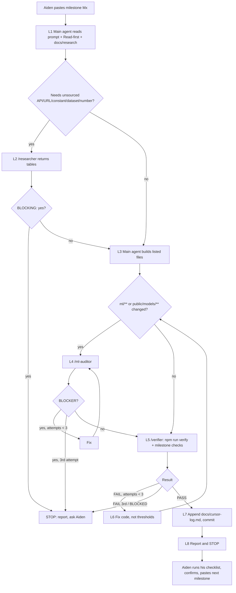

# StarMind Nav: PLAN-v2 (final build plan)
Owner: Aiden Park. Repo: github.com/aipstotra-ui/BRHSpaceX.

Built from three sources:
- PLAN-v1 (received Sat Oct 3 2026 12:10 PM ET)
- the technical fixes in `review-swe.md` ("SWE")
- the fact-check in `review-researchy.md` ("Researchy"), phases 1 and 2, both complete

Revision 2 adds:
- Researchy phase-2 corrections
- the reference benchmarks
- Researchy's adopted improvements
- Cursor-ready milestone prompts
- a fixed subagent workflow
- a description of the finished product

Revision 3 (approved by Aiden):
- Re-aims the product at choosing Starmind's orbit ("location"): the one that minimizes impact on the chosen chip and maximizes its lifetime.
- Adds core milestones M5 (orbit environment + location picker), M6 (globe with the Starmind model), M7 (climatology + orbit optimizer) and M9 (storm scenario).
- Moves the policy/replay to M8, the Validation Lab to M10, voice to M11, hardening to M12 and submission to M13.
- Renumbers the extensions X1–X7.

Number tags:
- `[SWE §x]` and `[Researchy <row>]` point to the review row a number comes from. Rows are A/B/C (APIs and data), P (premise), R (radiation), N (baseline numbers), §6 (benchmarks) and Imp-n (suggested improvements).
- `estimate` means a design choice or rough guess with no external source.
- `UNVERIFIED` means Researchy couldn't confirm the value, or no review covers it. It stays visibly labeled in the UI and docs.
- The v1-era tag `PENDING-CHECK` is retired. Every item Researchy resolved now carries its value and URL. Every item it couldn't resolve is `UNVERIFIED`.

There is no clock schedule and there are no time estimates. Scope is never cut because of a deadline.

---

## 0. How to use this plan with Cursor
1. **Before M0:** copy this file into the repo as `docs/PLAN-v2.md`. M0 turns its Section 3 and Appendix A into `docs/research/*` and `.cursor/*`. Every later prompt points at those files instead of repeating them.
2. **One milestone per chat turn.** Paste exactly one prompt block into Cursor Agent: everything between `<!-- BEGIN PROMPT Mx -->` and `<!-- END PROMPT Mx -->`. Order:
   - Core: M0 → M11
   - Optional extensions, in order: X1 → X7
   - Finish: M12 → M13
3. **The agent runs the fixed loop** (Section 3), stops at "Stop here and report", and posts the report in the fixed format (§3.4). It never starts the next milestone itself.
4. **You run "Aiden's verify checklist"** under the prompt block. That means:
   - re-run the agent's verify commands yourself
   - do the manual checks (browser, voice, devices)
   - answer anything listed under "Needs from Aiden"
5. **Then you confirm and paste the next milestone.** If the agent stopped early, reply with the answer or fix and say `continue Mx`. The agent resumes the same milestone at the loop step where it stopped.
6. Some prompts ask you for inputs in the paste message: the initial orbit (M5), the AI1 mass/drag inputs (M5, if unpublished), approval of optimizer weights (M7), approval of the policy cost table (M8), and permission to push. Give these as one line above the pasted block.

---

## 1. What changed from v1

**Product aim (rev 3)** [Aiden, rev 3]
- **New aim:** find the orbit ("location") for Starmind that minimizes impact on the chosen chip and maximizes its lifetime, then manage storms on that orbit.
- **New core milestones:**
  - **M5:** an orbit-averaged environment model (SAA/L-shell exposure, eclipse fraction, density/drag) and a location picker (altitude, inclination, and LTAN for SSO). The Orbit Impact panel shows upset rate, annual dose, lifetime (TID and drag-decay), eclipse/thermal margin and storm sensitivity as labeled ranges.
  - **M6:** a Starmind 3D model on the globe beside the Starlink shells, with camera follow and a radiation-colored trail. The orbit redraws live.
  - **M7:** a climatology + orbit optimizer with a heatmap on the globe, a best-orbit highlight, and a one-click ILLUSTRATIVE transfer with a labeled coplanar Hohmann Δv. It absorbs v1's Orbit Navigator, which rev 2 had as an extension, and replaces v1's "raise orbit" action.
  - **M8:** replays run on the chosen orbit vs the default.
  - **M9:** a storm scenario ("what-if") input, by hand or imported from NOAA's 3-day forecast or DONKI CME arrivals, labeled SCENARIO and range-checked with zod.
  - **M11:** the voice tools `set_orbit`, `rank_orbits` and `run_scenario`.
- **Explicit rule:** long-range orbit choice uses **climatology** (storm frequency by size across OMNI history and solar-cycle phase), **not** the short-term forecaster.
- **New core validations:**
  - dose vs altitude/inclination against a cited reference table (researcher gate; otherwise labeled `estimate`)
  - SSO inclination vs published values
  - eclipse fraction vs Skyfield, and density vs pymsis (both moved into core from v1's extended list)
  - labeled lifetime ranges
  - an optimizer determinism test
  - scenario input range tests
- **Extensions renumbered:** X1 SEP, X2 Imagine, X3 Workload Router, X4 Feb 2022/2003 replays, X5 extended validations, X6 SHAP, X7 polish.


**Plan structure and agents**
- **One plan.** The repo's 3rok plan (`docs/mvp-phase-plan.md`) is archived to `docs/archive/` as the first M0 step. `3rok-design-system/` stays as the UI kit. Its PlacementMap and thermal scale drive the Payload Health grid. [SWE (b)1, §1.3]
- **Agents cut from 11 to 3** Cursor subagents (researcher, verifier, ml-auditor) plus 3–4 short rules with correct frontmatter. The main Agent does all building. The `.claude/agents` mirror is dropped. `docs/cursor-log.md` is kept as evidence. [SWE §2.1–2.4]
- **Process gates replaced** by one fixed loop per milestone (Section 3). The researcher runs only when a milestone needs an unsourced external fact. The ml-auditor runs only when `ml/` changed. The verifier runs at the end of every milestone, and you confirm at each STOP. [SWE (b)2, §1.2; Aiden decision 3]
- **Milestones are Cursor prompt blocks.** Shared context lives in `docs/research/` and `.cursor/rules/`, written in M0. [Aiden, rev 2]
- **Core-first order.** The Vercel deploy happens in M0 and is re-checked in every milestone. [SWE (b)6, §1.6] The items SWE suggested cutting become [EXTENSION] milestones X1–X7 instead of being deleted. [SWE (c) cut line; Aiden decision 4]

**Forecaster**
- **Leakage fixes** [SWE (b)4, §3.1–3.8]:
  - Kp uses the last completed 3-h block.
  - F10.7 is lagged 1 day.
  - 48 h embargo at each split boundary.
  - Trailing windows only.
  - Per-column fill map to NaN, and no scaler.
  - Only features that are also available live.
  - Quantile outputs are sorted before display.
  - Tune on val, and touch test once.
- **Published benchmarks added as reference lines, not pass gates:**
  - Zhelavskaya 2019 for Kp
  - Chakraborty & Morley 2020 for Kp
  - Gruet 2018 for Dst
  - Sadykov 2021 for SEP

  [Researchy §6, Imp-5]

**Policy and SEP**
- **Policy fixes** [SWE §3.2, §3.10]:
  - Policy features are out-of-fold forecasts.
  - The oracle is a simplified 4-action lookahead-greedy (continue / checkpoint / throttle / safe mode).
  - Migrate moves to the X3 extension. Raise/lower-orbit is now an output of the core orbit optimizer (M7), not a policy action.
- **SEP labels come from the NOAA NCEI SEP table.** [Researchy top 1, B15–B17]
  - Not from umbra (ends Sep 2017), SPE.txt (unreachable), or OMNI (the proton column is fill after 2020-03-04).
  - This overrides SWE's OMNI-label suggestion.
  - Calibration is a bin→prob lookup JSON, and hits and misses are counted per event. [SWE §3.9]

**Corrected facts and figures**
- **May 2024 storm.**
  - The SEP onset is 2024-05-10 13:35 UT, not May 9. [Researchy C1]
  - Kp 9 comes from GFZ definitive data. [Researchy N21]
  - Dst −406 nT is the WDC Kyoto **provisional** value. [Researchy N22]
- **OMNI facts corrected.** [Researchy B12–B15]
  - Solar wind and IMF data are sparse before 1995.
  - The latest data lags ~2.5 weeks.
  - Kp/Dst sit at 0-based column index 38/40.
  - Fill values differ per column.
- **AI1 premise corrected.** [Researchy P2–P5, N11, Imp-2, Imp-9]
  - The orbit is "sun-synchronous" (official). 500–2,000 km is SpaceX's FCC constellation filing range, not an AI1 altitude.
  - The NVL72 basis was disclosed on the Aug 4 2026 earnings call, and NVIDIA announced it Aug 24 2026.
  - "SpaceX targets Q4 2027" comes from Musk on X. SEC filings said as early as 2028.
  - Sun-facing time: the FCC filing says "up to more than 99%" for high-altitude SSO. The ~98% figure is UNVERIFIED.
- **Power is two presets, not a 150–230 kW slider.** [Researchy N12–N15, Imp-1]
  - spacex.com sheet: 175 kW average / 250 kW peak / 160 m² radiator / 210 kW solar
  - alternate sheet: 120 kW average / 150 kW peak solar / 110 m²
  - Sliders: average 120–175 kW, peak 150–250 kW.
- **Radiator anchor is 160 m², not 158** (158 is Engadget's rounding). [Researchy N15–N16, Imp-3]
  - The 320–340 K band holds only if both radiator faces radiate.
  - 250 kW peak can't be shed in steady state by 160 m².
  - The 1-/2-sided setting and Tsink are exposed in the UI.
- **Chip-preset semantics corrected.** [Researchy R1, R6–R9, N5, Imp-8]
  - Orin 19 krad(Si) is a functional limit from one test campaign.
  - The Trillium 2 krad(Si) figure is the HBM first-anomaly point. Its no-hard-fail-to-15-krad(Si) result is from n = 1 chip.
  - The NVL72's 3,600 PFLOPS is a sparse figure.
- **Feb 2022.** [Researchy N18–N20, extra finding, Imp-7, Imp-10]
  - Cite Fang et al. 2022 for "38 of 49 lost".
  - The storm was G1 (Kp 5+), not G1–G2.
  - CelesTrak has only 6 decay dates, so decay validation is weak. Validate against Fang et al. instead.

**Data and architecture**
- **Raw OMNI is not committed.** It's 184 MB, over GitHub's 100 MB limit. Use a download script plus a compact Parquet instead. [SWE (b)5, §4.1]
- **ONNX is client-only.** [SWE (b)6, §3, §4.7–4.9]
  - Export uses `zipmap=False`.
  - onnxruntime-web runs with `numThreads=1` and explicit `wasmPaths`.
  - `model-card.json` defines the feature order, enforced by a contract test.
- **Grok fixes.**
  - The token route uses `force-dynamic`, and the WebSocket is never proxied through Vercel. [SWE §4.2]
  - Audio format is nested. [Researchy A6]
  - The token max is 1 h. [Researchy A3]
  - The fallback uses `/v1/responses`, not chat completions. [Researchy A16]
  - Video is polled by `request_id`. [Researchy A15]
  - The model is pinned to a versioned name. [Researchy A2]
- **SWPC and other feeds.**
  - SWPC JSON is arrays of objects. Filter RTSW to `active==true`, and add `rtsw_mag_1m.json` for live Bz. [Researchy B1–B10]
  - DONKI uses the new base URL only. [Researchy B11]
  - The NGDC anomaly DB is dropped. [Researchy B19]
  - CelesTrak is snapshotted. [Researchy B20–B22]
- **GFZ definitive Kp** is used for spot checks and as the Kp reference. [Researchy N19, N21, Imp-4]
- **Storm G-level is derived from Kp** using NOAA's table. [Researchy Imp-10]
- **Globe is client-only.** It uses `ssr:false`, one `Points` buffer, and worker propagation. [SWE §4.4–4.6]

**Verification**
- **Acceptance criteria follow SWE §5:**
  - `npm run verify`
  - the key-leak grep
  - the leakage pytest
  - an offline check
  - measurable fps, latency and skill thresholds
- **Validation Lab core.** It covers ML skill, the policy backtest, 3 physics anchors, and (rev 3) the orbit-model checks. Everything else is listed as "Planned validations" until X5 builds it. [SWE (b)3]

---

## 2. Context and premise
- **Event:** BigRed//Hacks 2026.
- **Theme "Navigation":** `UNVERIFIED`. It isn't on Devpost or the site. [Researchy P6]
- **SpaceX track "Make it Legendary"** [Researchy P7] (https://bigredhacks2026.devpost.com/):
  - must be built with Cursor (more use = better odds)
  - must use the Grok Imagine **or** Voice API
  - Grok Bot planning earns bonus points
  - must use real space data
- **Also entered:** BigRed main track (automatic), plus the Software and Design side tracks. [Researchy P8]
- **Submission and judging:**
  - "GitHub link + Google Drive PDF deck" is `UNVERIFIED`. The Devpost rules page returned 403, so check it while logged in. [Researchy P10]
  - "2-min pitch + 2-min Q&A; finalists 4 + 2" is `UNVERIFIED`. [Researchy P11]
  - Confirm both with the organizers in M13.
  - The deadline is intentionally not used for planning.
- **Premise (all from Researchy):**
  - SpaceX's Starmind AI1 flies a space-optimized NVIDIA Vera Rubin NVL72. [Researchy P1] Sources: https://nvidianews.nvidia.com/news/spacexai-adopts-nvidia-vera-cpu-to-accelerate-agentic-ai-at-massive-scale and https://www.supercomputing.news/emerging/nvidia-nvl72-starmind-spacex-ai1-spec-sheets-diverge
  - The NVL72 basis was disclosed on SpaceX's Aug 4 2026 earnings call, and NVIDIA's press release came Aug 24 2026. [Researchy P2]
  - SpaceX targets Q4 2027 for AI1 (Musk on X, per https://qz.com/spacex-nvidia-ai-satellites-orbit-2027-082526). Earlier SEC/IPO materials said "as early as 2028". [Researchy P3]
  - The orbit is sun-synchronous (https://www.spacex.com/spacexai/starmind). [Researchy P4]
- **Product:**
  - Finds the orbit ("location") for Starmind that minimizes impact on the chosen chip and maximizes its lifetime. The long-range choice uses climatology.
  - Forecasts the space environment from decades of history.
  - Translates the forecast into impact on any user-specified AI chip payload (NVL72 is the default preset).
  - Recommends the best move with a learned policy.
  - Backtests everything against what actually happened.
- **Principle:** calculate or predict, then compare against published data. Labels and assumptions are always visible.

---

## 3. Subagent workflow (fixed; copied verbatim into `docs/research/workflow.md` in M0)

### 3.1 Roles

| Role | Trigger | Inputs | May touch | May NOT touch | Output (format → where) | What the main agent does with it |
|---|---|---|---|---|---|---|
| **Main agent** (Cursor Agent chat) | The milestone prompt you paste | the prompt, files under "Read first", `docs/research/*`, `.cursor/rules/*` | files listed under the milestone's "Files", plus tests and helpers inside the same directories (helpers are listed in the report). `docs/research/*` is written only with researcher output. `docs/cursor-log.md` is append-only. | other milestones' work, `docs/archive/**`, `ml/data/raw/**` in git, thresholds in a verify list, `git push` (unless you allow it in the paste message), `--final` test evaluation (except where the milestone says so) | code + the report (§3.4) → chat | n/a |
| **/researcher** (`readonly: true`) | Loop step L2. Required when the milestone needs an external API shape, URL, constant, dataset format, chip spec or published number that isn't already in `docs/research/` with status CONFIRMED or CORRECTED. | a numbered question list, each naming its target file `docs/research/<file>.md` | read the repo, search the web/docs | any file (readonly), any code | one table per target file: `TARGET: docs/research/<file>.md`, then a table with columns Item, Value, Unit, Source URL, Accessed, Status, Note. Status ∈ CONFIRMED, CORRECTED, UNVERIFIED. Ends with `BLOCKING: yes/no` → chat | Pastes the tables into the target files unchanged. `BLOCKING: no` → proceed, labeling UNVERIFIED values `UNVERIFIED` everywhere they're used. `BLOCKING: yes` → **stop and ask Aiden** (report status STOPPED). |
| **/verifier** (`readonly: false` so it can run terminal commands; told not to edit files) | Loop step L5 in every milestone, and after every fix (L6) | milestone id, attempt number, the milestone's "Agent verify" list | run commands. Build outputs those commands create (`.next/`, caches) are fine. | creating, editing or deleting tracked files; thresholds; tests; git commit/push; `--final` evaluation unless it's on the list | header line `VERIFY <Mx> attempt <n>: PASS/FAIL/BLOCKED`, a table with columns #, Check, Command, Expected, Actual, Result, then one likely-cause line per FAIL → chat | PASS → L7. FAIL → fix and re-run (L6). BLOCKED (missing key, network, input) → **stop and ask Aiden**. |
| **/ml-auditor** (`readonly: true`) | Loop step L4. Required when `git diff --name-only <milestone-start-sha>` includes `ml/**` or `public/models/**`. | milestone id, attempt number, the changed-file list | read the repo | any file (readonly), running training or `--final` | header line `AUDIT <Mx> attempt <n>: CLEAN/FINDINGS`, then a table with columns Rule (L1–L13 of `ml-rules.md`), File:line, Severity, Finding, Suggested fix. Severity is BLOCKER, SHOULD-FIX or OK. → chat | CLEAN → L5. BLOCKER → fix and re-audit (L6). SHOULD-FIX → fix, or record it in `docs/research/findings.md` with a reason, then L5. |

A BLOCKER is anything that could make a reported validation or test metric optimistic: leakage, test reuse, in-sample policy features, or features that aren't available live.

### 3.2 The per-milestone loop (L1–L8)
- **L1 Read.** Read the pasted prompt, every file under "Read first", and `docs/research/workflow.md`. Record the start commit: `git rev-parse HEAD`.
- **L2 Research gate (conditional).** If the milestone needs a fact that isn't sourced in `docs/research/`, call `/researcher` with the question list.
  - Paste its tables into the target files.
  - `BLOCKING: yes` → stop and ask Aiden.
- **L3 Build.** Do the numbered steps in order, touching only the listed files.
  - New numbers must come from `docs/research/` with a source, or be labeled `estimate` or `UNVERIFIED`.
- **L4 ML audit (conditional).** If `ml/**` or `public/models/**` changed, call `/ml-auditor`.
  - BLOCKER → fix, re-audit.
  - SHOULD-FIX → fix or log it in `findings.md`.
- **L5 Verify.** Call `/verifier` with the milestone's "Agent verify" list. It always runs `npm run verify` first.
- **L6 Fix loop.** On FAIL, the main agent fixes code (never the thresholds) and repeats L4 (if `ml/` changed again) and L5.
  - **Max 3 verifier attempts per milestone, and max 3 audit attempts.** The 3 is an `estimate` (a design choice).
  - After the 3rd FAIL or BLOCKER, **stop and report** with the failing rows.
  - BLOCKED → stop immediately and report what's needed.
- **L7 Log and commit.**
  - Append to `docs/cursor-log.md`: `| Mx | <date> | researcher: <n Qs / not used> | ml-auditor: <result / not used> | verifier: <PASS after n> | <short sha> |`
  - Then `git add -A && git commit -m "Mx: <goal>"`.
  - Don't push unless your paste message allows it.
  - Production deploys use `npx vercel deploy --prod` (linked in M0), so they don't depend on pushing.
- **L8 Report and STOP.** Post the report (§3.4). Don't start the next milestone.



### 3.3 Which steps apply
Each prompt has a line "Loop steps: …". L1, L3, L5, L6, L7 and L8 always apply. L2 and L4 apply only when the prompt marks them, or when their trigger fires anyway. A trigger always wins, so if a milestone unexpectedly touches `ml/`, L4 runs.

### 3.4 Report format (main agent, at L8)
```
## Mx report
Status: DONE | STOPPED at L<n> (<reason>)
Built: <files created/changed, helper files>
Subagents: researcher <n questions, BLOCKING?> | ml-auditor <CLEAN/FINDINGS, attempts> | verifier <PASS/FAIL/BLOCKED, attempts>
Verify table: <verifier's final table, verbatim>
New numbers introduced: | value | where used | label (source URL / estimate / UNVERIFIED) |
Findings / open issues: <bullets, also in docs/research/findings.md>
Needs from Aiden: <decisions or inputs, or "none">
```

---

## 4. Milestones
Order:
1. Core: M0 → M11, in this order: chip impact (M4) → orbit location (M5) → globe (M6) → optimizer (M7) → policy/replay (M8) → scenario (M9) → Validation Lab (M10) → voice (M11)
2. Optional extensions, in order: X1 → X7
3. Finish: M12 → M13

Each milestone below has three parts:
- a Cursor prompt block (paste only this)
- **Aiden's verify checklist**
- the STOP line

---

### M0: Foundation, workflow encoding, Vercel deploy
**Aiden, before pasting:**
- Clone the repo.
- Copy this file to `docs/PLAN-v2.md`.
- Have Vercel CLI login and `XAI_API_KEY` ready. You'll set the key in Vercel env yourself, never in chat.

<!-- BEGIN PROMPT M0 -->
**Milestone M0: Foundation, workflow encoding, Vercel deploy**

**Goal:**
- The 3rok plan is archived.
- Next.js + Python scaffold exists.
- The subagents, rules and `docs/research/` shared context are written from `docs/PLAN-v2.md`.
- The empty shell is deployed to Vercel production.

**Loop steps:** L1, L3, L5, L6, L7, L8. Skip L2: every fact here is already in `docs/PLAN-v2.md`. Skip L4: no ML code yet.

**Read first:** `docs/PLAN-v2.md` Sections 0–3 and Appendix A (reference only; execute only M0). `3rok-design-system/` (list its files).

**Files:**
- `docs/archive/mvp-phase-plan.md` (moved)
- `package.json`, `tsconfig.json`, `next.config.ts`, `vitest.config.ts`, `playwright.config.ts`, `app/layout.tsx`, `app/page.tsx`
- `components/ui/SourceBadge.tsx`
- `lib/types.ts`, `lib/schemas/chipSpec.ts`
- `ml/requirements.txt`, `ml/tests/test_smoke.py`
- `.gitignore`
- `scripts/preprocess/download_omni.sh`
- `.cursor/agents/{researcher,verifier,ml-auditor}.md`, `.cursor/rules/{architect,ml,ui}.mdc`, optionally `.cursor/rules/3rok-design-system.mdc`
- `docs/research/*.md` (list in step 7), `docs/research/deploy.md`
- `docs/cursor-log.md`

**Steps:**
1. Run `git mv docs/mvp-phase-plan.md docs/archive/mvp-phase-plan.md` and commit "archive 3rok plan". Leave `3rok-design-system/` in place.
2. Scaffold Next.js App Router with strict TypeScript, Tailwind, shadcn/ui, Zustand, zod, react-hook-form, Vitest and Playwright. Pin the versions in Appendix A7 where given.
3. Create the Python venv at `ml/.venv`. Write `ml/requirements.txt` with the pinned versions from Appendix A7, and `ml/tests/test_smoke.py` (imports lightgbm, onnxmltools, onnxruntime).
4. Add the npm scripts `verify` and `check:keys` exactly as in Appendix A7. If `next lint` doesn't exist in the installed Next.js, use `eslint .` and note it in the report.
5. `.gitignore` covers `ml/data/raw/`, `ml/.venv/`, `.env*`, `.next/`, `node_modules/`, and `test-results/`.
6. Create the 3 subagent files and 3 rule files with **exactly** the contents below. If `3rok-design-system/` contains a `.mdc` rule, copy it to `.cursor/rules/3rok-design-system.mdc` and remove any text that comes from the archived 3rok plan (product bans, naming bans). Don't create `.claude/agents/`.
7. Create `docs/research/` from `docs/PLAN-v2.md`, copying verbatim:
   - `workflow.md` ← Section 3
   - `reference-values.md` ← A1
   - `api-xai.md` ← A2
   - `api-swpc.md` ← A3 (SWPC + DONKI)
   - `data-sources.md` ← A4
   - `ml-rules.md` ← A5
   - `commands.md` ← A7
   - `benchmarks.md` ← A6
   - `engine-constants.md` ← A8
   - `chip-presets.md` ← A9
   - `hackathon.md` ← A10
   - `orbit-model.md` ← A11
   - `findings.md`: empty table with columns Date, Milestone, Finding, Action
8. Write `lib/types.ts` with these types: ChipSpec, PayloadConfig, OrbitState, WeatherState, Forecast (with quantiles P10/P50/P90), ChipImpact, ActionRecommendation, OrbitRanking, BacktestResult, ValidationMetric, SourcedNumber. `SourcedNumber` is `{value, unit, label: "source"|"estimate"|"UNVERIFIED", sourceUrl?}`.
9. Write `lib/schemas/chipSpec.ts`, the ChipSpec zod schema.
   - Required: vendor, name, nodeNm, acceleratorCount, cpuCount, memoryType, memoryCapacity, eccScheme, avgPowerKw, peakPowerKw, opTempMinC/MaxC, shieldingMmAl.
   - Optional: seuCrossSection, tidLimitKradSi, latchupLet, dieArea.
   - Write `PayloadConfig` with: radiatorAreaM2, radiatorSides (1|2), tSinkK, emissivity.
10. Build `components/ui/SourceBadge.tsx`, which renders source/estimate/UNVERIFIED. Build the shell `app/page.tsx` with a header and empty section placeholders titled "Chip Spec Studio", "Space Environment", "Orbit Location", "Orbit Impact", "Orbit Optimizer", "AI Forecast", "Payload Health", "Best Move", "Time Machine", "Storm Scenario" and "Validation Lab", using the design-system tokens.
11. Write `scripts/preprocess/download_omni.sh`. It downloads `omni2_YYYY.dat` for 1963 through the current year from the URL in Appendix A4 into `ml/data/raw/`, with retries, and is idempotent. Run it in the background.
12. Run `npx vercel link`, then `npx vercel deploy --prod`. Write the production URL to `docs/research/deploy.md`. Don't print or write `XAI_API_KEY` anywhere; Aiden sets it in Vercel env.
13. Create `docs/cursor-log.md` with header columns Milestone, Date, researcher, ml-auditor, verifier, sha.

**Exact file contents:**

`.cursor/agents/researcher.md`
```markdown
---
name: researcher
description: Source-of-truth researcher for StarMind Nav. Use at loop step L2, before building anything that needs an external API shape, URL, physical constant, chip spec, dataset format, or published number that is not already in docs/research/ with status CONFIRMED or CORRECTED. Returns sourced tables; never edits files.
model: inherit
readonly: true
is_background: false
---
You are the researcher for StarMind Nav.

Input: a numbered list of questions from the main agent; each names its target file docs/research/<file>.md.

Rules:
1. Check docs/research/ first. If a question is already answered there with a source URL, return that row unchanged.
2. Prefer primary sources (official API docs, agency data pages, papers with DOI) over news. Open the page; do not rely on search snippets alone.
3. No URL, no value. If no opened source states the value, return Status UNVERIFIED and say what you tried.
4. If sources conflict, return one row per source and mark the primary one "preferred" in Note.
5. Never edit files, never write code, never invent or round numbers.

Output, for each target file:
TARGET: docs/research/<file>.md
| Item | Value | Unit | Source URL | Accessed | Status | Note |
Status is one of CONFIRMED, CORRECTED (put the old value in Note), UNVERIFIED.
Last line: BLOCKING: yes|no. Say yes only if an item the milestone cannot be built without is UNVERIFIED; name it.
```

`.cursor/agents/verifier.md`
```markdown
---
name: verifier
description: Runs StarMind Nav verification commands and milestone checks and reports pass/fail. Use at loop step L5 of every milestone and after every fix. Never fixes anything.
model: inherit
readonly: false
is_background: false
---
You are the verifier for StarMind Nav. You run checks; you never fix.

Input: milestone id, attempt number, and the milestone's "Agent verify" list (commands plus expected results).

Rules:
1. From the repo root, run `npm run verify` first, then every listed check in order. Do not skip checks after a failure.
2. Do not create, edit, or delete tracked files. Do not change thresholds, tests, or config. Do not git commit or push. Build outputs created by the commands themselves are fine.
3. Never run evaluation with `--final` unless that exact command is in the list.
4. If a check cannot run because a credential, network access, URL, or human action is missing, mark it BLOCKED (not FAIL) and say what is missing.
5. Manual checks (browser, voice, phone) are listed for Aiden; mark them "MANUAL - for Aiden" and do not attempt them.

Output:
VERIFY <milestone> attempt <n>: PASS|FAIL|BLOCKED
| # | Check | Command | Expected | Actual (key value or last 20 lines) | Result |
Then one line per FAIL with the most likely cause (file:line if known). Overall PASS only if every non-manual row is PASS.
```

`.cursor/agents/ml-auditor.md`
```markdown
---
name: ml-auditor
description: Read-only auditor for leakage and split hygiene in StarMind Nav ml/ code and exported models. Use at loop step L4 whenever ml/** or public/models/** changed in the current milestone.
model: inherit
readonly: true
is_background: false
---
You are the ML auditor for StarMind Nav.

Input: milestone id, attempt number, and the list of changed files (git diff --name-only <milestone start sha>).

Audit every changed file, plus anything it imports in ml/, against rules L1-L13 in docs/research/ml-rules.md. Also check data/validation/test-runs.log for repeated --final runs of the same model version.

Severity:
- BLOCKER: anything that could make a reported validation or test metric optimistic (leakage, test reuse, tuning on test, in-sample policy features, a feature not available live, SEP labels not from the NCEI table).
- SHOULD-FIX: hygiene issues that do not bias metrics.
- OK: rule checked and satisfied.

Never edit files, run training, or run --final.

Output:
AUDIT <milestone> attempt <n>: CLEAN|FINDINGS
| Rule | File:line | Severity | Finding | Suggested fix |
List every rule L1-L13 at least once (OK if satisfied or not applicable).
```

`.cursor/rules/architect.mdc`
```markdown
---
description: StarMind Nav global rules - scope, numbers, sources, workflow, secrets
globs:
alwaysApply: true
---
- Execute only the milestone prompt pasted in chat. docs/PLAN-v2.md and docs/archive/ are reference only. Never start another milestone; stop at loop step L8.
- Follow docs/research/workflow.md (loop L1-L8, subagent triggers, max 3 verifier and 3 audit attempts, report format).
- Never invent numbers. Every number in code, UI, or docs is either sourced from docs/research/ (with URL), labeled `estimate` (design choice), or labeled `UNVERIFIED`. If a needed value is missing, call /researcher (L2).
- API shapes, URLs, constants, and chip data come only from docs/research/.
- Calculate or predict, then compare with a reference; report residual, % error or skill, and uncertainty.
- TypeScript strict, no `any`, zod at every external boundary, pure functions in lib/engine/.
- XAI_API_KEY is server-only. Never create NEXT_PUBLIC_XAI* variables. Never print secrets.
- Never commit ml/data/raw/ or any file over 90 MB. Never edit docs/archive/.
- Never weaken a verify threshold to make a check pass.
```

`.cursor/rules/ml.mdc`
```markdown
---
description: ML leakage, split, and export rules for StarMind Nav
globs: ml/**,public/models/**,lib/ml/**
alwaysApply: false
---
- Obey docs/research/ml-rules.md L1-L13 exactly. Summary: strict time splits with 48 h embargo; Kp feature = last completed 3-h block; daily indices lagged 1 day; trailing windows only (no center=True, bfill, or interpolation; ffill limit 3 h); per-column fill map to NaN, no scaler; live-available features only; tune on val; test only via `--final`, once per model version, logged; policy features from OOF forecasts only; SEP labels only from the NCEI table.
- ONNX: convert_lightgbm(target_opset=15), zipmap=False, write public/models/model-card.json with ordered features[] and a golden vector.
- Sort quantiles P10<=P50<=P90 before display.
- Literature benchmarks in docs/research/benchmarks.md are reference lines, never pass gates.
```

`.cursor/rules/ui.mdc`
```markdown
---
description: StarMind Nav UI rules
globs: app/**,components/**
alwaysApply: false
---
- Use 3rok-design-system/ tokens and components (PlacementMap and thermal scale for Payload Health).
- Every displayed number renders a SourceBadge (source | estimate | UNVERIFIED).
- Every panel has loading, error, and empty states; show the snapshot banner when data comes from data/snapshots/.
- three, react-globe.gl, satellite.js workers, and onnxruntime-web are client-only (dynamic import, ssr:false). Never import them, ml/, or data/history/ from app/api/**.
- Dark, minimal, data-dense; no console errors.
- Scenario outputs always carry a SCENARIO badge; never call them forecasts or predictions.
- Long-range orbit outputs (optimizer, multi-year lifetime) are labeled "climatology", never "forecast".
- The orbit-transfer animation is labeled ILLUSTRATIVE (not a maneuver plan); the Starmind model is labeled "illustrative geometry, not to scale".
```

**Constraints:** follow `.cursor/rules/architect.mdc`. No numbers beyond what Appendix A gives.

**Agent verify** (send to `/verifier`, attempt n):
1. `npm run verify` exits 0.
2. `npm run build` exits 0.
3. `test ! -e docs/mvp-phase-plan.md && test -e docs/archive/mvp-phase-plan.md && echo OK` prints `OK`.
4. `ls .cursor/agents` prints exactly `ml-auditor.md researcher.md verifier.md`. `ls .claude/agents 2>/dev/null | wc -l` prints `0`.
5. `head -5 .cursor/rules/*.mdc` shows `description`, `globs` and `alwaysApply` in every file.
6. `rg -n "mvp-phase|3rok plan" .cursor/` prints nothing.
7. `ls docs/research` lists every file named in step 7, plus `deploy.md`.
8. `git check-ignore ml/data/raw/omni2_2024.dat` prints the path.
9. `curl -s -o /dev/null -w "%{http_code}\n" "$(cat docs/research/deploy.md | rg -o 'https://\S+' | head -1)"` prints `200`.
10. `npm run check:keys` exits 0.
11. `git status --porcelain` after the verifier run lists nothing beyond the main agent's own uncommitted changes. This confirms the verifier edits nothing even with `readonly: false`.

Stop here and report (format §3.4). Do not start the next milestone.
<!-- END PROMPT M0 -->

**Aiden's verify checklist**
- [ ] Re-run Agent verify items 1–11. All pass.
- [ ] Open the prod URL. The shell renders with all 11 section titles.
- [ ] In Cursor, type `/`. The three subagents appear, and nothing from `.claude/agents` shows up.
- [ ] Vercel env has `XAI_API_KEY` (server), and nothing named `NEXT_PUBLIC_XAI*`.

**STOP: Aiden confirms before the next milestone.**

---

### M1: Grok Voice de-risk
<!-- BEGIN PROMPT M1 -->
**Milestone M1: Grok Voice de-risk**

**Goal:** A browser voice session on the prod URL calls one dummy tool and speaks its result. The `/v1/responses` text fallback works with the WebSocket blocked. Optionally, one Imagine image.

**Loop steps:** L1, L3, L5, L6, L7, L8. L2 only if `docs/research/api-xai.md` lacks a needed field. Skip L4.

**Read first:** `docs/research/api-xai.md`, `docs/research/commands.md`.

**Files:** `app/api/grok/token/route.ts`, `app/api/grok/text/route.ts`, `app/api/grok/image/route.ts` (optional), `lib/grok/realtime.ts`, `lib/grok/audio-worklet.ts`, `lib/grok/playback.ts`, `lib/grok/toolLog.ts`, `components/panels/VoiceTest.tsx`, `tests/unit/grok/*.test.ts`.

**Steps:**
1. Token route: `export const dynamic = "force-dynamic"`, `export const runtime = "nodejs"`, response header `Cache-Control: no-store`.
   - It POSTs to `https://api.x.ai/v1/realtime/client_secrets` with body `{"expires_after":{"seconds":300}}`. 300 s is an `estimate` (TTL); the max is 3600 per api-xai.md.
   - It returns `{value, expires_at}`.
   - Don't send a session or `anchor` field.
2. `realtime.ts`: start the mic and the WebSocket in parallel. Open `new WebSocket("wss://api.x.ai/v1/realtime?model=grok-voice-think-fast-2.0", ["xai-client-secret."+value])` directly from the browser. Never proxy the WebSocket through Vercel.
3. Send `session.update` with:
   - `voice`
   - `instructions`
   - `turn_detection:{type:"server_vad"}`
   - `audio.input.format` and `audio.output.format` = `{type:"audio/pcm",rate:24000}`
   - `reasoning.effort:"none"`
4. Mic and playback:
   - The AudioWorklet downsamples mic float audio to 24 kHz Int16, base64-encodes it, and sends chunks about every 100 ms (`estimate`).
   - Playback is a gap-free queue on one `AudioContext({sampleRate:24000})`.
5. Register the dummy tool `get_test_value`, which returns a constant labeled `estimate`. On `response.function_call_arguments.done`, send `conversation.item.create {type:"function_call_output", call_id, output}`. Send all parallel outputs before one `response.create`, after playback finishes.
6. Fallback text route: `POST https://api.x.ai/v1/responses` with the same tool schema. Loop over `function_call` → `function_call_output` using `previous_response_id`, with model `grok-4.7` (as in the function-calling guide). The browser speaks the answer with `speechSynthesis`. Never call `/v1/chat/completions`.
7. `toolLog.ts`: an on-screen and console log of every tool call (name, args, output). `VoiceTest.tsx` shows the transcript, the tool log and a "fallback mode" badge.
8. Optional image route: `POST https://api.x.ai/v1/images/generations` with `model:"grok-imagine-image-2.0"` and `response_format:"b64_json"`. Render `data[0].b64_json`.
9. Run `npx vercel deploy --prod`.

**Constraints:** the key stays server-only, the WebSocket is never proxied, and there are no numbers except the labeled `estimate`s above.

**Agent verify:**
1. `npm run verify` exits 0.
2. `curl -s -X POST <prod>/api/grok/token | jq 'has("value") and has("expires_at")'` prints `true`. Two calls return different `value`s.
3. `curl -sI -X POST <prod>/api/grok/token | rg -i "cache-control: no-store"` matches.
4. `rg -n "chat/completions" app lib` prints nothing.
5. `rg -n "wss://api.x.ai" app/api` prints nothing (no WebSocket proxy).
6. `npm run check:keys` exits 0.
7. MANUAL (for Aiden): voice round-trip and fallback.

Stop here and report (format §3.4). Do not start the next milestone.
<!-- END PROMPT M1 -->

**Aiden's verify checklist**
- [ ] Re-run Agent verify items 1–6.
- [ ] On the prod URL, saying "what is the test value" logs ≥1 `get_test_value` call, and Grok speaks the exact number shown in the tool log.
- [ ] Block `wss://api.x.ai` in DevTools (Network → Block request URL) and reload. The same question goes through `/v1/responses`, the tool is logged, and the answer is spoken by `speechSynthesis`.
- [ ] (If step 8 was done) one image renders.

**STOP: Aiden confirms before the next milestone.**

---

### M2: Data layer and training table
<!-- BEGIN PROMPT M2 -->
**Milestone M2: Data layer and training table**

**Goal:**
- A parsed, fill-cleaned OMNI hourly Parquet.
- NCEI SEP labels.
- GOES history for at least May 2024.
- Typed live SWPC/DONKI feeds with snapshot fallback.
- CelesTrak and GFZ snapshots.
- A data report.

**Loop steps:** L1, **L2 (required)**, L3, **L4 (required: ml/ changes)**, L5, L6, L7, L8.

L2 questions:
- (a) NCEI GOES-R SEISS and GOES 1-15 archive file formats and URLs for ≥10 MeV protons and 0.1–0.8 nm X-rays, covering 2003, 2022 and 2024 → `data-sources.md`
- (b) a live F10.7 source with JSON shape → `api-swpc.md`
- (c) RTSW wind field names → `api-swpc.md`
- (d) GFZ Kp JSON response shape → `data-sources.md`
- (e) the pressure formula OMNI uses for flow pressure, from `omni2.text` → `data-sources.md`

**Read first:** `docs/research/data-sources.md`, `api-swpc.md`, `ml-rules.md`, `reference-values.md`.

**Files:** `ml/parse_omni.py`, `ml/scrape_sep.py`, `ml/fetch_goes_history.py`, `ml/fetch_gfz_kp.py`, `ml/data/omni_hourly.parquet`, `data/history/sep_events.csv`, `data/history/goes_*.parquet`, `ml/tests/test_data.py`, `lib/data/swpc.ts`, `lib/data/donki.ts`, `lib/data/schemas.ts`, `lib/engine/gscale.ts`, `ml/gscale.py`, `app/api/data/[feed]/route.ts`, `data/snapshots/*.json`, `scripts/preprocess/snapshot_celestrak.sh`, `scripts/preprocess/snapshot_feeds.sh`, `docs/research/data-report.md`, `tests/unit/data/*.test.ts`, `components/ui/SnapshotBanner.tsx`.

**Steps:**
1. `parse_omni.py`:
   - Split each line on whitespace (55 fields) and build the UTC timestamp from year/doy/hour.
   - Kp = `round(col[38]*3/10)/3` and Dst = `col[40]` (0-based).
   - Apply the per-column fill map from `data-sources.md` (fills → NaN).
   - Compute Pdyn with the formula from L2(e).
   - **Don't** parse the OMNI proton column.
   - Write `ml/data/omni_hourly.parquet` with only the used columns plus missingness flags.
2. `scrape_sep.py`: fetch the NCEI SEP table HTML, normalize whitespace inside cells, and write `data/history/sep_events.csv` with start_ut, max_ut, peak_pfu, flare and region where present.
3. `fetch_goes_history.py`: use the formats and URLs from L2(a). If no parseable archive exists for May 2024, write `findings.md` row "BLOCKER: no GOES proton history for replay" and report STOPPED.
4. `fetch_gfz_kp.py`: fetch the GFZ definitive Kp JSON for 2024-05-10..11 and 2022-02-02..04 into `data/snapshots/gfz_kp_2024-05.json` and `data/snapshots/gfz_kp_2022-02.json`.
5. `lib/engine/gscale.ts` and `ml/gscale.py` give the G-level from Kp using NOAA's table in `reference-values.md` (G1 = Kp 5 … G5 = Kp 9). Add a parameter for how thirds below an integer are treated. The default is a numeric threshold, so 5− = 4.67 → G0, labeled `estimate` pending Aiden's decision.
6. `lib/data/schemas.ts` + `swpc.ts`:
   - zod schemas (arrays of objects) for every feed in `api-swpc.md`.
   - `rtsw_wind_1m` and `rtsw_mag_1m` are filtered to `active===true` and sorted ascending.
   - The Kp forecast keeps `observed==="predicted"` rows.
   - Add live F10.7 from L2(b). If none is CONFIRMED, mark F10.7 "dropped from features" in `findings.md`.
7. `donki.ts`: base `https://ccmc.gsfc.nasa.gov/DONKI-API/get/`, with SEP rows filtered to `instruments[].displayName` containing "GOES".
8. `app/api/data/[feed]/route.ts`: proxy with a short cache (cache seconds = `estimate`) and fall back to `data/snapshots/<feed>.json`. The response includes `source: "live"|"snapshot"`. `SnapshotBanner.tsx` shows when the source is snapshot.
9. `snapshot_feeds.sh` and `snapshot_celestrak.sh`: fetch every feed, plus CelesTrak GP, SupGP, SATCAT JSON, `satcat.csv` and SATCAT `INTDES=2022-010` (saved as `data/snapshots/satcat_2022-010.json`), with retries, into `data/snapshots/`. The app reads only snapshots for CelesTrak.
10. `data-report.md` covers:
    - coverage per column per decade
    - the last valid OMNI hour per column
    - final vs quicklook Dst
    - the OMNI-end vs SWPC ~7-day window gap. Live inference needs only recent lags. The test set ends at the last valid OMNI hour.
11. `test_data.py` (checks below).

**Constraints:**
- `ml-rules.md`.
- No raw files in git, and nothing over 90 MB.
- Every threshold below comes from `reference-values.md`.

**Agent verify:**
1. `npm run verify` exits 0.
2. `ml/.venv/bin/pytest ml/tests/test_data.py -q` passes, asserting:
   - (a) max OMNI Kp in 2024-05-10..11 == 9.0, and equals GFZ definitive Kp 9.0 for the 2024-05-11 00–03 UT block
   - (b) min Dst in that window is within ±20 nT (the tolerance is SWE §5.8's) of −406 nT, the provisional WDC Kyoto value
   - (c) no parsed column contains its fill value
   - (d) Bz non-NaN fraction for 1995 ≥ 0.95 (Researchy measured 99%)
   - (e) SEP CSV row count equals the count scraped from the page. 319 is expected as of Oct 3 2026; report the actual.
   - (f) SEP rows start at 2024-05-10 13:35 and 2024-05-11 02:10 UT, and the first row is 1976-04-30
   - (g) GFZ Feb 2022 max Kp == 5.333, and `gscale(5.333)` == G1
3. `vitest run tests/unit/data`: a mixed SOLAR1/ACE/IMAP fixture yields only `active===true` records, ascending.
4. `git check-ignore ml/data/raw/omni2_2024.dat` prints the path. `find . -size +90M -not -path "./node_modules/*" -not -path "./.git/*" -not -path "./ml/data/raw/*"` prints nothing.
5. `jq length data/snapshots/satcat_2022-010.json` → report the value (Researchy saw 17).
6. MANUAL (for Aiden): offline check.

Stop here and report (format §3.4). Do not start the next milestone.
<!-- END PROMPT M2 -->

**Aiden's verify checklist**
- [ ] Re-run Agent verify items 1–5.
- [ ] Turn DevTools offline and reload. `/api/data/kp` and the page serve the snapshot and show the banner, and the page doesn't go blank. [SWE §5.11]
- [ ] Read `docs/research/data-report.md`. Decide on F10.7 if it was dropped.
- [ ] Decide the G-scale handling of thirds (see open questions).

**STOP: Aiden confirms before the next milestone.**

---

### M3: Kp/Dst forecaster, ONNX in the browser, AI Forecast panel
<!-- BEGIN PROMPT M3 -->
**Milestone M3: Kp/Dst forecaster, ONNX in the browser, AI Forecast panel**

**Goal:** LightGBM quantile forecasters (P10/P50/P90) for Kp and Dst at +3/+6/+12/+24 h, all leakage-safe and evaluated once on test. They are exported to ONNX and run in the browser from live SWPC inputs. The panel shows the bands, the NOAA overlay, skill vs persistence, and literature reference lines.

**Loop steps:** L1, L2 (only if `benchmarks.md` or `api-swpc.md` lacks something needed), L3, **L4 (required)**, L5, L6, L7, L8.

**Read first:** `docs/research/ml-rules.md`, `benchmarks.md`, `commands.md`, `api-swpc.md`, `data-report.md`.

**Files:** `ml/features.py`, `ml/splits.py`, `ml/train_forecast.py`, `ml/evaluate.py`, `ml/export_onnx.py`, `ml/tests/test_leakage.py`, `public/models/forecast_*.onnx`, `public/models/model-card.json`, `public/models/golden_forecast.json`, `data/validation/forecast.json`, `data/validation/test-runs.log`, `lib/ml/ort.ts`, `lib/ml/features.ts`, `lib/ml/forecast.ts`, `components/panels/AIForecast.tsx`, `tests/unit/ml/*.test.ts`.

**Steps:**
1. `features.py`: implement the features exactly per `ml-rules.md` L3–L7.
   - last-completed-block Kp and its lags
   - Dst lags
   - trailing stats of Bz, By, V, n, Pdyn
   - F10.7 lagged 1 day, if kept in M2
   - missingness flags
2. `splits.py`: L1–L2. Train ≤ 2019-12-31, val 2020–2022, test 2023-01-01 → last valid OMNI hour, with a 48 h embargo at each boundary.
3. `train_forecast.py`:
   - LightGBM `objective='quantile'`, α ∈ {0.1, 0.5, 0.9}, for both targets × 4 horizons.
   - Kp models are issued at 3-h block boundaries.
   - `num_leaves≈15`, ≤150 trees, early stopping on val [SWE §3].
   - Compare training start 1963 (with NaN and missingness flags) against 1995 on val only, and keep the better one.
4. Persistence baseline: last-completed-block Kp, and Dst at issue time.
5. `evaluate.py --final` computes, per target×horizon on test:
   - MAE(P50), MAE_persist, and skill = 1 − MAE/MAE_persist
   - **RMSE and Pearson CC** for model and persistence
   - P10–P90 coverage

   It writes `data/validation/forecast.json` and appends one line `<date> <model_version> forecast --final` to `test-runs.log`. It **refuses to run** if that model version is already logged. Run `--final` exactly once, after val tuning is finished.
6. `export_onnx.py`:
   - `convert_lightgbm(..., target_opset=15)`
   - `model-card.json` contains:
     - ordered `features[]`, units, fill handling
     - split dates and the actual test end date
     - training start year
     - the final (OMNI) vs live (RTSW L1 + quicklook) gap note
   - `golden_forecast.json` holds input and expected output.
7. `lib/ml/ort.ts`:
   - client-only dynamic `import("onnxruntime-web")`, pinned to 1.30.0
   - `ort.env.wasm.wasmPaths` = the jsdelivr URL for 1.30.0 (or `public/ort/`)
   - `ort.env.wasm.numThreads = 1`
   - one session per model, reused
   - log `session.run` ms
8. `lib/ml/features.ts` builds the tensor from live SWPC data in `model-card.json` order. `forecast.ts` sorts P10 ≤ P50 ≤ P90.
9. `AIForecast.tsx` shows:
   - bands per horizon
   - the NOAA predicted-Kp overlay
   - a skill table from `forecast.json`
   - a "Literature reference" table from `benchmarks.md`, labeled "different datasets and periods; not a head-to-head score"
   - honest per-horizon text. Persistence is strong at +3 h [SWE §3.12].
10. Optional, val only: only if M2 produced a GOES 0.1–0.8 nm X-ray history covering train and val, add X-ray flux as a Kp feature. Keep it only if val skill improves, and record the result in `model-card.json`. Never decide this on test. [Researchy Imp-6]
11. Run `npx vercel deploy --prod`.

**Constraints:**
- `ml-rules.md` L1–L13.
- Literature numbers are reference lines, **not** pass gates.
- No `onnxruntime-web` import under `app/api/**`.

**Agent verify:**
1. `npm run verify` exits 0.
2. `ml/.venv/bin/pytest ml/tests/test_leakage.py -q` passes, asserting:
   - (a) max(train) + 48 h < min(val), and max(val) + 48 h < min(test)
   - (b) for 100 random rows, features recompute identically from data ≤ issue time
   - (c) the Kp feature at t equals the block ending ≤ t
3. `rg -n "center=True|bfill|interpolate\(" ml/` prints nothing. Every `ffill` has `limit<=3`.
4. `jq '.' data/validation/forecast.json`. **Pass gates** [SWE §5.3]:
   - skill > 0 at +6, +12 and +24 h for both Kp and Dst
   - P10–P90 coverage between 0.70 and 0.90 for every target×horizon
   - the +3 h result is reported whatever its sign
5. Report the **reference comparison** (not a gate) as a table: our test RMSE/CC vs the published numbers in `benchmarks.md`.
   - Kp +3 h: Zhelavskaya 2019 GB RMSE 0.674 / CC 0.872, persistence 0.847 / 0.808. Chakraborty & Morley 2020 RMSE 0.77 / CC 0.83.
   - Kp +6 h: Zhelavskaya GB 0.879 / 0.770, persistence 1.077 / 0.690.
   - Dst +6 h: Gruet 2018 CC 0.873 / RMSE 9.86 nT.
   - Also our own persistence RMSE/CC, for the like-for-like check.
6. `wc -l < data/validation/test-runs.log` equals the number of distinct forecast model versions.
7. `du -ch public/models/forecast_*.onnx | tail -1` ≤ 5 MB [SWE §3]. If it's over, ship P50 for all horizons plus P10/P90 for 2 horizons.
8. Vitest contract test: TS builds the tensor from `model-card.json`, runs the golden vector through ORT (node), and matches the Python output within 1e-5 (SWE measured ≤ 3.7e-6).
9. `rg -l "onnxruntime" .next/server/app/api` prints nothing.
10. MANUAL (for Aiden): browser latency.

Stop here and report (format §3.4). Do not start the next milestone.
<!-- END PROMPT M3 -->

**Aiden's verify checklist**
- [ ] Re-run Agent verify items 1–9.
- [ ] **This resolves "ORT-web in a real Next.js browser build"** [SWE "Not verified"]. On the prod URL, the logged warm `session.run` p50 over 20 runs is < 50 ms, and cold start (wasm fetch + session create) is < 3 s [SWE §5.4]. Write both into `docs/cursor-log.md`.
- [ ] The response headers on `/` have no COOP/COEP (not needed with `numThreads=1`).
- [ ] The panel's literature table is visibly labeled as reference, not as a score.

**STOP: Aiden confirms before the next milestone.**

---

### M4: Chip Spec Studio, chip-impact simulator, Payload Health
<!-- BEGIN PROMPT M4 -->
**Milestone M4: Chip Spec Studio, chip-impact simulator, Payload Health**

**Goal:**
- A zod form for any chip, with sourced presets including two AI1 presets.
- A deterministic impact engine covering upsets, ECC, dose, thermal and drag flag, with estimate flags and a ±σ band.
- A Payload Health grid.
- The 4-action cost model.

**Loop steps:** L1, **L2 (required)**, L3, L5, L6, L7, L8. L4 only if `ml/` is touched.

L2 questions → `chip-presets.md` / `engine-constants.md`:
- per-preset memory, ECC, node and power values, and any published SEU cross-sections for H100, Jetson Orin AGX/NX, TPU v6e Trillium and a rad-hard reference processor
- trapped-proton/SAA flux and the SAA polygon source
- an L-shell approximation source
- storm multipliers from Kp/Dst/GOES protons, if any are published (otherwise `estimate`)

**Read first:** `docs/research/chip-presets.md`, `engine-constants.md`, `reference-values.md`, `3rok-design-system/`.

**Files:** `lib/engine/{chipModel,radiation,upsets,dose,thermal,drag,impact,actions,montecarlo}.ts`, `lib/presets.ts`, `ml/policy_costs.json`, `components/panels/{ChipSpecStudio,PayloadHealth}.tsx`, `tests/unit/engine/*.test.ts`.

**Steps:**
1. `lib/presets.ts`, built only from `chip-presets.md`:
   - **"Starmind AI1 (spacex.com sheet)"** (default): NVL72 (72 Rubin GPUs, 36 Vera CPUs, 20.7 TB HBM4, 288 GB/GPU), avgPowerKw 175, peakPowerKw 250, radiator 160 m², solar 210 kW
   - **"Starmind AI1 (alternate sheet)"**: avgPowerKw 120, peak 150 kW (Researchy: peak *solar* on that sheet, so label it that way), radiator 110 m²
   - H100 (Starcloud-1), Jetson Orin AGX/NX, Google TPU v6e Trillium, a rad-hard reference, and Custom

   Semantics per `chip-presets.md` [Researchy Imp-8]:
   - Orin AGX "TID functional limit 19 krad(Si), one test campaign"
   - Trillium "HBM first irregularity 2 krad(Si); no hard TID failure to 15 krad(Si), n = 1 chip"
   - NVL72 "3,600 PFLOPS NVFP4 (sparse)"
   - Values that are UNVERIFIED stay labeled: TSMC N3, terrestrial rack power, HBM2 paper findings, and Orin latch-up.
2. `chipModel.ts`: unknown fields are estimated from process-node and memory scaling with widened uncertainty, and outputs carry `isEstimate` and `assumptions[]`.
3. `upsets.ts`: flux × σ × bits × storm multiplier, plus ECC load and the DUE/SDC split. Multipliers come from `engine-constants.md` or are labeled `estimate`. `radiation.ts`: SAA polygon, L-shell approximation, storm multipliers. `dose.ts`. `drag.ts` is a flag only here; M5 adds orbit-averaged drag and decay time.
4. `thermal.ts`: A = P / (n·ε·σ·(T⁴ − Tsink⁴)) with σ = 5.670374e-8, n ∈ {1, 2} (the `radiatorSides` setting), and user-set Tsink.
   - It outputs:
     - the area at the average power
     - the steady-state area needed at peak power
     - the back-solved radiator temperature for the preset's own power/area pair
   - Results are flagged as lower bounds: compute power isn't total bus heat, and absorbed sunlight/albedo/IR and fin efficiency are ignored.
   - Show the radiator temperature next to the chip's temperature limit (NVL72 inlet 45 °C). [Researchy N16 redo, Imp-3]
5. `montecarlo.ts`: a ±σ sweep over unknown chip parameters only [SWE §1.4].
6. `actions.ts` + `ml/policy_costs.json`: the 4 actions (continue, checkpoint, throttle, safe mode). Every cost value is labeled `estimate`. Propose values and list them under "Needs from Aiden" for approval. TS and Python (M8) read the same JSON.
7. `ChipSpecStudio.tsx`: react-hook-form + zod, a preset picker, custom entry, estimated-field indicators, separate **average** (120–175 kW range for AI1) and **peak** (150–250 kW) sliders, a radiator-sides toggle, and a Tsink input.
8. `PayloadHealth.tsx`: `3rok-design-system/` PlacementMap and thermal scale. Tiles adapt to the chip (NVL72: 72 GPUs, 36 CPUs, HBM stacks) and are colored by upsets, ECC load and dose. Wire the panel to the M3 forecast (P50, with a P90 stress case).
9. Run `npx vercel deploy --prod`.

**Constraints:**
- Every value comes from `chip-presets.md`/`engine-constants.md` with a URL, or is labeled `estimate`/`UNVERIFIED`.
- No AI1 altitude is stated as fact.

**Agent verify:**
1. `npm run verify` exits 0.
2. Vitest property test: 50 random zod-valid ChipSpecs with random missing optional fields. All outputs are finite, and `isEstimate===true` whenever a dependency was missing [SWE §5.7].
3. Vitest snapshot of every preset's outputs passes.
4. Vitest thermal golden test, ε = 0.9, Tsink 200 K, 2-sided. The values must match Researchy's table within ±0.1 m²:
   - 175 kW: 193.0 m² at 320 K and 145.8 m² at 340 K
   - 120 kW: 132.3 / 99.9 m²
   - 250 kW: 275.7 / 208.2 m²
   - 1-sided 175 kW: 385.9 / 291.5 m²
5. Vitest: for the spacex.com preset (2-sided, Tsink 200 K), the 320–340 K band (145.8–193.0 m²) contains 160 m². For the alternate preset, the band (99.9–132.3 m²) contains 110 m². With 1-sided, the band does **not** contain 160. Peak 250 kW needs > 160 m² across 320–340 K, so the UI shows a "peak not steadily sheddable; must be buffered or short" flag.
6. Vitest: the back-solved kW/m² for both AI1 presets is 1.09 ± 0.01. The back-solved T (2-sided, Tsink 200 K) for the spacex.com preset is 333 ± 1 K.
7. `rg -n "158 ?m|1,700 ft|150-230|150–230" app components lib` prints nothing. `docs/research/reference-values.md` legitimately mentions these as corrected values.
8. MANUAL (for Aiden): UI walk-through.

Stop here and report (format §3.4). Do not start the next milestone.
<!-- END PROMPT M4 -->

**Aiden's verify checklist**
- [ ] Re-run Agent verify items 1–7.
- [ ] In the browser, every preset and one random custom chip render with no console errors. Estimated fields are visibly flagged.
- [ ] Approve or edit the proposed `policy_costs.json` values (all `estimate`).

**STOP: Aiden confirms before the next milestone.**

---

### M5: Orbit environment model, location picker, orbit impact panel
**Aiden, in the paste message:** give the initial demo orbit. It is SSO by default, and you supply the altitude and the local time of ascending node (LTAN). The inclination is computed from the altitude. The orbit will be labeled "assumption; AI1 altitude not published". [Researchy P5]

<!-- BEGIN PROMPT M5 -->
**Milestone M5: Orbit environment model, location picker, orbit impact panel**

**Goal:**
- The user picks Starmind's "location" (a circular orbit) with sliders and presets: altitude, inclination, and for SSO the LTAN.
- The physics engine computes an **orbit-averaged environment**: SAA and L-shell/auroral exposure, eclipse fraction, and atmospheric density/drag.
- The Orbit Impact panel shows, for the chosen chip at that orbit:
  - upset rate
  - annual dose
  - estimated lifetime (time to TID limit, and drag-decay time)
  - eclipse/thermal margin
  - storm sensitivity
- Every value is a range with a source, `estimate` or `UNVERIFIED` label.

**Loop steps:** L1, **L2 (required)**, L3, L5, L6, L7, L8. L4 only if `ml/**` changes. The precompute scripts live in `scripts/orbit/`.

If the paste message has no initial orbit, **stop at L1 and ask**.

L2 questions (targets: `docs/research/orbit-model.md`, `engine-constants.md`):
- (a) Earth constants μ, R_E and J2, from a primary source (e.g. WGS84/EGM), and the SSO condition (the required nodal precession rate), with source.
- (b) **Dose vs altitude and inclination** for circular LEO orbits behind stated Al shielding depths. This must be a published table or SPENVIS-style AP8/AE8 + SHIELDOSE-2 output, including the source, solar min/max condition, and shielding depths.
  - If it can only be obtained by running SPENVIS (account needed), say so. Aiden may run it and commit the export to `data/orbit/refs/`.
  - Otherwise `BLOCKING: no`. Dose is then an `estimate` scaled from the 750 rad(Si)/5-yr shielded anchor (Google Suncatcher) by the SAA-exposure ratio.
  - That anchor's own orbit must be sourced; otherwise the scaling basis is `UNVERIFIED`.
- (c) The atmospheric density model: NRLMSIS 2.0 via pymsis (source, and required inputs such as F10.7/Ap) for precomputing density vs altitude × activity.
- (d) A solar position algorithm and a shadow model (cylindrical or conical) for eclipse, with sources.
- (e) An L-shell / geomagnetic-latitude approximation, plus a sourced definition of the auroral-zone and outer-belt bands.
- (f) Starmind AI1 mass and drag area, or ballistic coefficient, plus a drag coefficient Cd and a reentry/end-of-life altitude.
  - If these are unpublished, `BLOCKING: no`: use user inputs labeled `estimate`.
  - Also check whether the solar-array area may be derived from spacex.com's "210 kW (at 250 W/m²)" (210 kW ÷ 250 W/m² = 840 m², *derived*). Confirm or reject that reading.
- (g) Published SSO inclinations for at least two altitudes, to use as a test reference.

**Read first:** `docs/research/orbit-model.md`, `engine-constants.md`, `reference-values.md` (orbit rows), `lib/engine/*` (M4).

**Files:** `lib/engine/orbit/{elements,j2,sso,sun,eclipse,saa,lshell,density,environment,lifetime}.ts`, `lib/engine/orbitImpact.ts`, `lib/store/orbit.ts` (Zustand), `lib/engine/orbit.worker.ts`, `scripts/orbit/{density_table,dose_table}.py`, `data/orbit/{density_table,dose_table}.json`, `data/orbit/refs/*`, `components/panels/{OrbitLocation,OrbitImpact}.tsx`, `tests/unit/orbit/*.test.ts`, `tests/e2e/orbit.spec.ts`.

**Steps:**
1. `elements.ts` + `sso.ts`: a circular orbit from (altitude km, inclination °, LTAN h or RAAN, epoch).
   - In **SSO mode**, the inclination is computed from the altitude with the J2 condition from L2(a). The inclination slider is locked and shows the computed value with its source.
2. `j2.ts`: two-body propagation with J2 secular RAAN drift. The step and averaging window are `estimate`s, recorded in `orbit-model.md`. It runs in `orbit.worker.ts`.
3. `sun.ts` + `eclipse.ts`: the sun vector and shadow model from L2(d). Output the eclipse fraction per orbit, plus the annual mean and seasonal range.
4. `saa.ts` + `lshell.ts`: the fraction of time inside the SAA polygon (from M4 `radiation.ts`, altitude-dependent if the source gives it), and the fraction in the auroral and outer-belt bands from L2(e).
5. `scripts/orbit/density_table.py` precomputes pymsis density over an altitude × F10.7 × Ap grid. The grid step is an `estimate`. Output: `data/orbit/density_table.json`. `density.ts` interpolates it.
6. `scripts/orbit/dose_table.py` builds `data/orbit/dose_table.json` from the L2(b) reference. If none exists, it uses the labeled `estimate` scaling. `--check` prints model vs reference per row.
7. `environment.ts` produces the orbit-averaged `{saaFraction, auroralFraction, outerBeltFraction, eclipseFraction, density(activity), annualDose(shielding)}`. Each value is a SourcedNumber with low/mid/high.
8. `lifetime.ts`:
   - time-to-TID = chip TID limit ÷ annual dose behind the chip's shielding, as a range
   - drag-decay time = the integral of da/dt = −ρ·(Cd·A/m)·√(μ·a) down to the end-of-life altitude, using the density table at a stated activity level (M7 replaces this with climatology)
   - estimated lifetime = the min of the two, with the **binding limit** named
9. `orbitImpact.ts` combines this with the M4 chip engine:
   - upset rate at the orbit (exposure-weighted M4 flux model)
   - annual dose
   - lifetime
   - eclipse/thermal margin: chip temperature limit − predicted temperature, over the sunlit/eclipse cycle, using M4 `thermal.ts`
   - storm sensitivity: Δupset and Δdrag for G1…G5 using M4's storm multipliers at this orbit
10. `OrbitLocation.tsx` has:
    - sliders for altitude (range = the FCC filing range 500–2,000 km, labeled "FCC constellation filing range, not AI1"), inclination (disabled in SSO mode) and LTAN
    - presets: Aiden's initial orbit (labeled assumption), SSO dawn-dusk (LTAN 06:00/18:00), SSO noon-midnight (12:00/00:00), and "Starlink shell" (mean altitude and inclination of the largest shell in the CelesTrak snapshot, *derived*)
    - an SSO/non-SSO toggle

    It writes to `lib/store/orbit.ts`, which the globe (M6) and replays (M8) read.
11. `OrbitImpact.tsx` shows ranges with SourceBadges and highlights the binding lifetime limit. It carries the note "orbit-averaged; multi-year values use climatology (M7), not the short-term forecaster".
12. Run `npx vercel deploy --prod`.

**Constraints:**
- No invented numbers. Grid steps, windows, Cd and end-of-life altitude are `estimate` unless L2 sources them.
- If L2(b) wasn't sourced, every dose and TID-lifetime value is labeled `estimate` in the UI.

**Agent verify:**
1. `npm run verify` exits 0.
2. Vitest SSO: the computed inclination for each L2(g) reference altitude is within tolerance of the published value. The tolerance is an `estimate`, recorded in `orbit-model.md`; report the residuals.
3. Vitest physics sanity, all else fixed:
   - density at activity X decreases with altitude
   - drag-decay time increases with altitude across 500–2,000 km
   - the annual-mean eclipse fraction for a dawn-dusk SSO ≤ that of a noon-midnight SSO at the same altitude
4. Vitest lifetime:
   - time-to-TID equals TID limit ÷ annual dose for fixtures
   - every lifetime output has low ≤ mid ≤ high and a label
   - estimated lifetime = min(TID, drag), and the binding limit is named
5. Dose vs reference: `python scripts/orbit/dose_table.py --check` prints per-row reference vs model with % error. At reference nodes, interpolation reproduces the table exactly. Leave-one-out % errors are reported for each altitude/inclination. With the `estimate` fallback, the output says "no reference: estimate" and the check reports that instead of passing silently.
6. Vitest zod: altitude outside the slider range, inclination outside [0, 180]°, and LTAN outside [0, 24) h are rejected.
7. Playwright `orbit.spec.ts`: moving the altitude slider changes the Orbit Impact values, and the count of numeric cells without a SourceBadge = 0.
8. Report the worker time per orbit-environment computation in ms (no gate; M6 has the fps gate).

Stop here and report (format §3.4). Do not start the next milestone.
<!-- END PROMPT M5 -->

**Aiden's verify checklist**
- [ ] Re-run Agent verify items 1–8.
- [ ] Move the altitude and LTAN sliders on prod. The impact ranges update, the binding lifetime limit is named, and every value has a badge.
- [ ] If the researcher reported that the dose reference needs a SPENVIS run, decide whether you'll run it (and commit the export to `data/orbit/refs/`) or accept the `estimate` scaling.
- [ ] Give the AI1 mass/drag area, or accept the `estimate` inputs.

**STOP: Aiden confirms before the next milestone.**

---

### M6: Globe with the Starmind model, Starlink shells, live orbit
<!-- BEGIN PROMPT M6 -->
**Milestone M6: Globe with the Starmind model, Starlink shells, live orbit**

**Goal:** A client-only 3D globe showing:
- Starlink shells (≤2k points total, from the snapshot)
- a small **Starmind 3D model** flying the orbit chosen in M5, with camera zoom and a follow mode
- a **trail colored by radiation exposure** (SAA, auroral zones)
- the SAA polygon and the OVATION aurora
- a time scrubber

The orbit redraws live when the M5 sliders move. There's an automatic 2D fallback.

**Loop steps:** L1, L3, L5, L6, L7, L8. Skip L2: everything comes from M2, M4 and M5 docs.

**Read first:** `docs/research/data-sources.md` (CelesTrak, OVATION), `orbit-model.md`, `engine-constants.md` (SAA polygon, bands), `reference-values.md` (AI1 dimensions), `lib/store/orbit.ts`.

**Files:** `components/globe/{Globe,GlobeClient,StarmindModel,OrbitTrail,CameraControls,GroundTrack2D}.tsx`, `lib/engine/propagate.worker.ts`, `components/panels/SpaceEnvironment.tsx`, `tests/unit/globe/*.test.ts`, `tests/e2e/globe.spec.ts`.

**Steps:**
1. `Globe.tsx` uses `dynamic(() => import("./GlobeClient"), { ssr: false })` [SWE §4.4].
2. `propagate.worker.ts`: `new Worker(new URL("./propagate.worker.ts", import.meta.url), { type: "module" })` [SWE §4.5].
   - Starlink: satellite.js on the CelesTrak snapshot at 1–2 Hz. Each tick posts one transferable `Float32Array` (lat, lng, alt × N), and the main thread interpolates.
   - Starmind: the M5 `j2.ts` propagator for the store's orbit.
3. Draw one three.js `Points` buffer with ≤2,000 Starlink points across the shells, subsampled proportionally per shell and labeled "subsampled" [SWE §4.6].
4. `StarmindModel.tsx`: a procedural three.js model (bus, two solar wings, radiator panels) proportioned from the spacex.com dimensions (75 m wingspan, 30 m height). It's drawn enlarged for visibility and labeled "illustrative geometry, not to scale". No external 3D asset unless its license is recorded in `findings.md`.
5. `OrbitTrail.tsx`: Starmind's recent ground path. Trail length is an `estimate`. Each segment is colored by exposure class from M5 `saa.ts`/`lshell.ts` (inside SAA, auroral band, outer belt, nominal), with a legend citing the band sources.
6. `CameraControls.tsx`: zoom, a "Follow Starmind" toggle, and free orbit.
7. Live redraw: subscribe to `lib/store/orbit.ts`, and recompute the orbit path in the worker on change. The debounce is an `estimate`.
8. Orbit label: "SSO (official). Altitude <value> = assumption. FCC filing range 500–2,000 km."
9. Add stats.js in dev, and fall back automatically to `GroundTrack2D.tsx` (with the same trail colors) if the median fps is < 45.
10. Run `npx vercel deploy --prod`.

**Agent verify:**
1. `npm run verify` exits 0.
2. `npm run build` passes, and no SSR `window is not defined` errors appear in the build output.
3. Vitest: worker propagation of one TLE matches satellite.js on the main thread. The worker's Starmind positions equal `j2.ts` positions for the same epoch.
4. Vitest exposure classification:
   - a fixture point inside the SAA polygon → `SAA`
   - a point in the auroral band → `auroral`
   - a point outside every band → `nominal`
5. Playwright `globe.spec.ts`: changing the M5 altitude slider updates the Starmind orbit radius in the scene state.
6. `rg -n "celestrak.org" components lib app`: only snapshot-script references, no runtime fetches.
7. If `next dev` (Turbopack) fails to load the worker, switch to `next dev --webpack` and report it [SWE §4.5].

Stop here and report (format §3.4). Do not start the next milestone.
<!-- END PROMPT M6 -->

**Aiden's verify checklist**
- [ ] Re-run Agent verify items 1–7.
- [ ] On the demo laptop, the median fps over 10 s with 2,000 Starlink points + the Starmind model + the trail is ≥ 45 (stats.js); otherwise the 2D fallback is active [SWE §5.2].
- [ ] **This resolves "satellite.js throughput"** [SWE §4.6]. Log the worker ms per tick in `docs/cursor-log.md`.
- [ ] Follow mode tracks Starmind. The trail lights up over the SAA. Moving the slider redraws the orbit live.

**STOP: Aiden confirms before the next milestone.**

---

### M7: Climatology and orbit optimizer
<!-- BEGIN PROMPT M7 -->
**Milestone M7: Climatology and orbit optimizer**

**Goal:**
- Find the orbit that minimizes impact on the chosen chip and maximizes its lifetime.
- **Long-range orbit choice uses climatology:** storm frequency by size across the OMNI history, grouped by solar-cycle phase. It does **not** use the short-term forecaster, and both the plan and the UI say so.
- Sweep candidate orbits, score each on impact + lifetime, and render a heatmap on the globe with the best orbit highlighted.
- One click animates Starmind moving from its current orbit to the recommended one. The animation is labeled ILLUSTRATIVE, with a labeled coplanar Hohmann Δv.

This milestone absorbs the old Orbit Navigator extension.

**Loop steps:** L1, **L2 (required)**, L3, **L4 (required: `ml/climatology.py`)**, L5, L6, L7, L8.

L2 questions → `orbit-model.md`:
- (a) Solar-cycle minimum/maximum dates (e.g. SILSO), or a sourced method to derive cycle phase from smoothed sunspot number. OMNI word 40 is sunspot R.
- (b) Dst storm-intensity class boundaries from a published source. If there isn't one, use G-levels from Kp only.
- (c) A published worked LEO Hohmann transfer example, to use as a test reference.

**Read first:** `docs/research/orbit-model.md`, `ml-rules.md`, `lib/engine/orbit/*`, `lib/engine/orbitImpact.ts`, `ml/data/omni_hourly.parquet`, `data/history/sep_events.csv`.

**Files:** `ml/climatology.py`, `ml/tests/test_climatology.py`, `data/orbit/climatology.json`, `lib/engine/orbit/{climatology,optimizer,hohmann}.ts`, `components/panels/OrbitOptimizer.tsx`, `components/globe/{OrbitHeatmap,TransferAnimation}.tsx`, `tests/unit/optimizer/*.test.ts`, `tests/e2e/optimizer.spec.ts`.

**Steps:**
1. `ml/climatology.py` writes `climatology.json` with:
   - storm-hours and storm counts per year by G-level (via `gscale` on Kp blocks), and by Dst class if L2(b) sourced one
   - those counts grouped by solar-cycle phase (L2(a))
   - F10.7/Ap distributions per phase (for density)
   - the SEP event rate per year per phase, from the NCEI table only
   - years covered and sources

   This uses the full history, including the test years, which is allowed for climatology. It must **never** be used as evidence of forecast skill (`ml-auditor` checks this).
2. `climatology.ts`: the expected environment for an orbit over a mission window that starts at a user-chosen year or phase. That's expected storm-hours by level × M5 storm sensitivity, plus the quiet baseline. Density comes from the activity distribution, and drag-decay and lifetime are recomputed on that basis.
3. `optimizer.ts`:
   - Candidate grid: altitude across the FCC filing range 500–2,000 km, and SSO with inclination computed × an LTAN grid. Optionally non-SSO inclinations. All grid steps are `estimate`s, shown in the UI.
   - Score: a weighted sum of normalized expected uncorrectable errors per year, annual dose, −lifetime, and a thermal-margin penalty. The weights are `estimate`s, shown and user-adjustable.
   - Deterministic: fixed grid order, no randomness, and a stated tie-break rule (lower altitude, then lower LTAN).
   - Returns the ranked list with each candidate's binding lifetime limit.
4. `hohmann.ts`: coplanar Hohmann Δv between circular altitudes, using μ and R_E from `engine-constants.md` and the formula in `orbit-model.md`. Labeled "coplanar Hohmann estimate; ignores plane/LTAN change and drag; not a maneuver plan".
5. `OrbitHeatmap.tsx`: each candidate orbit drawn on the globe as a faint ring colored by score, with the best one bright and labeled. `OrbitOptimizer.tsx` adds a 2D altitude × LTAN heatmap, the ranked table, weight sliders, and a "raise/lower orbit" recommendation vs the current orbit.
6. `TransferAnimation.tsx`: the "Move Starmind to best orbit" button animates an interpolated path from the current orbit to the best one, then updates `lib/store/orbit.ts`. A banner reads "ILLUSTRATIVE, not a maneuver plan" and shows the Hohmann Δv label.
7. UI copy, verbatim: "Long-range orbit choice uses climatology (storm frequency by size across OMNI history and solar-cycle phase), not the short-term forecaster."
8. Export `rankOrbits(chip, options)` for the M11 voice tool.
9. Run `npx vercel deploy --prod`.

**Agent verify:**
1. `npm run verify` exits 0.
2. `pytest ml/tests/test_climatology.py -q` passes, asserting:
   - recomputing from `omni_hourly.parquet` reproduces `climatology.json`
   - the years covered match the data
   - G-level counts use `gscale`
   - SEP rates come from `sep_events.csv` only
3. Vitest determinism: the same inputs twice give deep-equal rankings and scores, and shuffling the candidate input order gives the same ranking.
4. Vitest logic:
   - the best candidate is the argmin score
   - raising the chip TID limit never shortens any candidate's TID lifetime
   - raising the dose weight never moves the best candidate to a higher-dose orbit
5. Vitest Hohmann:
   - Δv(a→a) = 0
   - Δv(a→b) = Δv(b→a)
   - the L2(c) worked example is matched within its published rounding
6. `rg -n "not the short-term forecaster" components` and `rg -n "ILLUSTRATIVE" components/globe` both match.
7. Playwright `optimizer.spec.ts`: "Move Starmind to best orbit" runs the animation, the orbit store equals the best candidate, and the Orbit Impact panel shows the new values.

Stop here and report (format §3.4). Do not start the next milestone.
<!-- END PROMPT M7 -->

**Aiden's verify checklist**
- [ ] Re-run Agent verify items 1–7.
- [ ] On prod, the heatmap renders, the best orbit is highlighted, the transfer animation plays with the ILLUSTRATIVE banner, and the climatology sentence is visible.
- [ ] Approve or edit the default score weights and grid steps (all `estimate`).

**STOP: Aiden confirms before the next milestone.**

---

### M8: Best-move policy and May 2024 replay on the chosen orbit
**Aiden, in the paste message:** confirm that `policy_costs.json` is approved.

<!-- BEGIN PROMPT M8 -->
**Milestone M8: Best-move policy and May 2024 replay on the chosen orbit**

**Goal:**
- A LightGBM policy that imitates a lookahead-greedy oracle, using out-of-fold forecasts and orbit-exposure features.
- A runtime expected-cost check.
- A test backtest against naive policies and the oracle.
- The May 2024 Time Machine, which runs on the **chosen orbit** and shows better/worse vs the default orbit. It also serves as the Storm Playbook.

**Loop steps:** L1, L3, **L4 (required)**, L5, L6, L7, L8. L2 only if the replay needs an unsourced fact.

**Read first:** `docs/research/ml-rules.md`, `reference-values.md` (May 2024 rows), `ml/policy_costs.json`, `public/models/model-card.json`, `lib/engine/orbit/*`, `lib/store/orbit.ts`.

**Files:** `ml/oof_forecasts.py`, `ml/data/oof_forecasts.parquet`, `ml/build_oracle.py`, `ml/train_policy.py`, `ml/evaluate_policy.py`, `ml/tests/test_policy.py`, `public/models/policy.onnx`, `public/models/golden_policy.json`, `data/validation/policy.json`, `data/replays/may2024.json`, `lib/ml/policy.ts`, `lib/engine/costCheck.ts`, `lib/engine/replayOnOrbit.ts`, `components/panels/{BestMove,TimeMachine}.tsx`, `tests/unit/policy/*.test.ts`.

**Steps:**
1. `oof_forecasts.py` (L10):
   - Train years: 5 expanding-window time-forward folds (SWE's example count).
   - Val/test years: forecasts from the final forecaster, trained on train only.
2. `build_oracle.py`:
   - cost(h, a) = downtime_cost(a) + E[uncorrectable](realized flux/Kp, chip σ, orbit exposure, a) × penalty + switch_cost, from `policy_costs.json` and the same formulas as `lib/engine`.
   - The label at t is the argmin over the 4 actions of Σ cost over t..t+24 h with the action held [SWE §3.10].
3. Sweep: 3 chip presets + ~20 random specs (SWE's counts) × a small orbit sample from the M7 grid (count `estimate`). Subsample non-storm hours to keep the table under 2M rows.
4. `train_policy.py`:
   - LightGBM multiclass on OOF P10/P50/P90, current conditions, chip sensitivity scalars (σ×bits, shielding, ECC class), and **orbit exposure scalars** from M5 (SAA, auroral and eclipse fractions).
   - Tune on val.
   - Export ONNX with `zipmap=False` and read `probabilities` only.
5. `costCheck.ts`: compute cost under P50 and P90. Override the classifier when its pick costs more than the best by X%, where X is an `estimate` set on val and recorded in `model-card.json`.
6. `evaluate_policy.py --final` (run once, logged) compares always-on, Kp≥7 threshold, policy and oracle on total cost, downtime h, uncorrectable events, and % of the oracle gap closed. Results go to `policy.json`.
7. `may2024.json` covers 2024-05-05..16 (May 2024 ±5 days around the storm, per SWE's window) and stays under 0.5 MB. It holds:
   - observed Kp (OMNI with GFZ cross-check) and Dst ("WDC Kyoto provisional")
   - GOES protons
   - G-level
   - forecasts
   - markers for the SEP onsets 2024-05-10 13:35 UT and 2024-05-11 02:10 UT, and the GFZ Kp 9 blocks at 2024-05-11 00–03 and 09–12 UT
8. `replayOnOrbit.ts`: propagate the **chosen** orbit and the **default** orbit (Aiden's M5 initial orbit) hourly through the window. Combine time-resolved SAA/auroral exposure with the observed conditions, then compute impact, policy actions and costs for both orbits.
9. `TimeMachine.tsx`: a timeline with AI vs naive vs oracle and a scrubber. A **"chosen vs default orbit"** delta table shows cost, downtime, uncorrectable events and dose, with better/worse marked. The Starmind trail on the globe replays the window. `BestMove.tsx` shows the action, the confidence, and expected costs vs the alternatives.
10. Run `npx vercel deploy --prod`.

**Constraints:**
- `ml-rules.md` L1–L13.
- Cost values are labeled `estimate`.
- The replay is labeled "test period".

**Agent verify:**
1. `npm run verify` exits 0.
2. `pytest ml/tests -q` passes, including the policy-features-from-OOF test [SWE §5.9(c)].
3. `jq '.' data/validation/policy.json`. **Pass** [SWE §5.5]: on 2023+, policy cost < threshold cost **and** < always-on cost. Report % of the oracle gap closed.
4. Vitest: policy ONNX probabilities equal Python within 1e-5 (SWE measured ≤ 1.8e-7), and TS cost equals Python cost on a golden set.
5. `du -h data/replays/may2024.json` < 0.5 MB.
6. Vitest replay checks:
   - the first non-`continue` recommendation < 2024-05-11T00:00Z
   - the SEP marker = 2024-05-10T13:35Z
   - chosen orbit = default orbit ⇒ every delta = 0
   - deltas change sign consistently when the chosen and default orbits are swapped
7. `rg -n "May 9" app components docs/PITCH.md 2>/dev/null` shows no use as the SEP onset.
8. `du -ch public/models/*.onnx | tail -1` ≤ 5 MB, and `test-runs.log` has one line per `--final` run.

Stop here and report (format §3.4). Do not start the next milestone.
<!-- END PROMPT M8 -->

**Aiden's verify checklist**
- [ ] Re-run Agent verify items 1–8.
- [ ] On prod, run the replay on the default orbit and on the optimizer's best orbit. The delta table and the better/worse labels change accordingly, and the SEP and Kp 9 markers sit at the right times.

**STOP: Aiden confirms before the next milestone.**

---

### M9: Storm scenario ("what-if") input
<!-- BEGIN PROMPT M9 -->
**Milestone M9: Storm scenario ("what-if")**

**Goal:**
- The user enters a hypothetical future storm by hand: CME speed, Bz, density, duration and arrival time.
- Alternatively, the user imports the NOAA SWPC 3-day forecast or DONKI CME arrival predictions.
- The scenario feeds the forecaster → impact → policy pipeline on the chosen orbit.
- Every output is labeled **SCENARIO**, never "forecast" or "prediction".
- Inputs are validated with zod plus physical range checks.

**Loop steps:** L1, **L2 (required)**, L3, **L4 (required: `ml/scenario_ranges.py`)**, L5, L6, L7, L8.

L2 questions → `api-swpc.md` / `orbit-model.md`:
- (a) DONKI CME analysis and arrival-prediction fields (e.g. WSA-Enlil simulation results) and endpoint, on the `ccmc.gsfc.nasa.gov/DONKI-API` base. Say whether Bz or density is predicted. Expect no.
- (b) The table layout of the Kp section in `3-day-forecast.txt`.
- (c) A sourced method for turning a CME speed/density into an L1 solar-wind profile. If none exists, `BLOCKING: no`: the user's values are used directly as L1 V/n/Bz in a step profile, labeled `estimate`.

**Read first:** `docs/research/api-swpc.md`, `ml-rules.md`, `public/models/model-card.json`, `lib/ml/*`, `lib/engine/*`, `lib/store/orbit.ts`.

**Files:** `ml/scenario_ranges.py`, `data/scenario/ranges.json`, `lib/scenario/{schema,profile,importNoaa,importDonki,run}.ts`, `components/panels/StormScenario.tsx`, `tests/unit/scenario/*.test.ts`.

**Steps:**
1. `scenario_ranges.py` writes the observed [min, max] per input to `ranges.json`, with sources and years covered:
   - V, n and Bz from OMNI 1995+
   - CME speed from the DONKI CME history
   - durations from the storm-hour runs in `climatology.json`

   Nothing is invented: the physical bounds are the observed extremes. A widening margin, if any, is an `estimate` and shown in the UI.
2. `schema.ts`: a zod schema `{cmeSpeedKmS, bzNt, densityCm3, durationH, arrivalTime}`.
   - Each numeric field is bounded by `ranges.json`.
   - durationH > 0.
   - arrivalTime is a valid ISO UTC time after now.
   - Errors name the bound and its source.
3. `profile.ts` builds an hourly L1 profile:
   - before arrival: the latest live values (snapshot fallback)
   - during the duration: the user's values (per L2(c))
   - after: relaxation to baseline (method is an `estimate`)

   Pdyn uses the M2 formula.
4. `importNoaa.ts` parses the Kp table of `3-day-forecast.txt` into a Kp timeline that feeds impact and policy directly, bypassing the forecaster. Labeled "SCENARIO from NOAA SWPC 3-day forecast".
5. `importDonki.ts` prefills speed and arrival from the L2(a) fields. The user supplies Bz and density.
6. `run.ts`: profile → features in `model-card.json` order → forecaster ONNX → Kp/Dst bands → impact at the chosen orbit → policy + cost check → timeline.
   - Flag "outside training range" for any feature beyond the training min/max. Add feature min/max to `model-card.json` if they're missing; that's an `ml/export_onnx.py` change, so L4 applies.
7. `StormScenario.tsx`:
   - a react-hook-form + zod form
   - Import NOAA / Import DONKI buttons
   - a persistent **SCENARIO** banner and badge on every output
   - the TimeMachine timeline component, reused
   - impact and policy results on the chosen orbit
8. Run `npx vercel deploy --prod`.

**Agent verify:**
1. `npm run verify` exits 0.
2. Vitest range tests:
   - each numeric field rejects min−ε, max+ε, NaN and ±Infinity, and accepts min and max
   - durationH ≤ 0 is rejected
   - a malformed or past arrivalTime is rejected
3. Vitest consistency: a zero-duration scenario reproduces the live AI Forecast output for the same inputs.
4. Vitest: the NOAA parser on the `3-day-forecast.txt` snapshot returns the same number of Kp rows and the same values as the file.
5. Vitest: every scenario result object has `label: "SCENARIO"`. A fixture outside the training range raises the warning.
6. `rg -n -i "prediction|forecast" components/panels/StormScenario.tsx`: every hit sits inside a "SCENARIO" or "imported NOAA forecast" phrase (report the lines).
7. `pytest -q ml/tests -k scenario`: `ranges.json` is reproducible from the data.

Stop here and report (format §3.4). Do not start the next milestone.
<!-- END PROMPT M9 -->

**Aiden's verify checklist**
- [ ] Re-run Agent verify items 1–7.
- [ ] On prod:
  - enter a manual storm
  - try an out-of-range value (rejected with its bound shown)
  - import NOAA
  - import DONKI (if a CME is listed)
  - check that the SCENARIO banner never disappears

**STOP: Aiden confirms before the next milestone.**

---

### M10: Validation Lab (core)
<!-- BEGIN PROMPT M10 -->
**Milestone M10: Validation Lab (core)**

**Goal:** One section shows every core calculation next to its reference, with residual, % error or skill, and error bars. It covers:
- forecast skill and coverage
- the policy backtest and the chosen-vs-default orbit replay
- physics anchors
- orbit-model checks: dose vs altitude, SSO inclination, eclipse fraction, density, lifetime ranges, optimizer determinism
- literature reference lines
- a "Planned validations" list

**Loop steps:** L1, L3, L5, L6, L7, L8. L4 if Python under `ml/` changes. L2 only if a reference value is missing.

**Read first:** `docs/research/benchmarks.md`, `engine-constants.md`, `orbit-model.md`, `reference-values.md`, `data/validation/*.json`, `data/orbit/*`.

**Files:** `scripts/validation/{anchors,orbit_checks,build_lab}.py`, `data/validation/{anchors,orbit_checks}.json`, `lib/validation/*.ts`, `components/panels/ValidationLab.tsx`, `components/ui/{ErrorBadge,UncertaintyBand,ResidualChart,ReliabilityDiagram}.tsx`, `docs/research/validation-report.md`, `tests/unit/validation/*.test.ts`, `tests/e2e/validation.spec.ts`.

**Steps:**
1. `anchors.py` → `anchors.json`, three anchors:
   - (a) **Radiator:** area vs the official 160 m² (spacex.com) and 110 m² (alternate). Show the back-solved T (≈333 K 2-sided at Tsink 200 K, ≈322 K 2-sided at Tsink 0 K, ≈383 K 1-sided at Tsink 0 K) and the sidedness note.
   - (b) **Shielded dose:** 5-yr shielded dose vs 750 rad(Si) (Google Suncatcher).
   - (c) **SGP4:** satellite.js vs python-sgp4 on one snapshot TLE (position RMSE over 24 h).
2. `orbit_checks.py` → `orbit_checks.json`:
   - (d) **Dose vs altitude/inclination:** the reference table from M5 vs the model, per row, with % error and leave-one-out errors. If there's no reference, the row shows "estimate; no reference" in amber.
   - (e) **SSO inclination:** computed vs the published values from M5 L2(g).
   - (f) **Eclipse fraction:** TS vs a Python reference using Skyfield (ephemeris file downloaded to `ml/data/raw/`, gitignored) for 3 orbits (the default, dawn-dusk and noon-midnight SSO). Report the absolute difference. The tolerance is an `estimate`, recorded with its basis.
   - (g) **Density:** `density.ts` interpolation vs a direct pymsis call at off-grid points, % error.
   - (h) **Lifetime ranges:** low/mid/high and label for the default and best orbits, with the binding limit.
   - (i) **Optimizer determinism:** the M7 test result (same ranking over 2 runs and under shuffled input).
3. Literature reference lines from `benchmarks.md`:
   - Kp 3 h: persistence RMSE 0.847 and GB 0.674 (Zhelavskaya 2019)
   - Dst 6 h: RMSE 9.86 nT (Gruet 2018)
   - SEP: NOAA TSS 0.786 / HSS2 0.748 (Sadykov 2021), hidden until X1 ships

   All labeled "literature reference; different data and periods".
4. `ValidationLab.tsx` shows the forecast table, the policy backtest, the orbit replay delta, the anchors, the orbit checks and the reference lines. Failing metrics are shown red with their value.
5. "Planned validations" lists every X5 item as "not yet run".
6. `validation-report.md` gives one row per check, with source URLs and the basis for each tolerance.
7. Run `npx vercel deploy --prod`.

**Agent verify:**
1. `npm run verify` exits 0.
2. `ls data/validation` includes `forecast.json`, `policy.json`, `anchors.json` and `orbit_checks.json`.
3. `jq '.radiator.reference_m2, .dose.reference_rad_si, .sgp4.rmse_km' data/validation/anchors.json` prints 160 (and 110), 750, and a number.
4. `jq 'keys' data/validation/orbit_checks.json` lists `dose_vs_altitude`, `sso_inclination`, `eclipse_fraction`, `density`, `lifetime`, `optimizer_determinism`. Every entry has `reference_source` or `"estimate"`.
5. Playwright `validation.spec.ts`: the count of numeric cells without a SourceBadge = 0.
6. `rg -n "158 ?m" components/panels/ValidationLab.tsx data/validation` prints nothing.

Stop here and report (format §3.4). Do not start the next milestone.
<!-- END PROMPT M10 -->

**Aiden's verify checklist**
- [ ] Re-run Agent verify items 1–6.
- [ ] On prod, every Lab number has a badge, and red/amber rows show their values rather than being hidden.

**STOP: Aiden confirms before the next milestone.**

---

### M11: Grok full tools and copilot UI
<!-- BEGIN PROMPT M11 -->
**Milestone M11: Grok full tools and copilot UI**

**Goal:** The voice copilot (with its text fallback) answers using real tool calls into the engine, models, orbit tools and scenarios. Spoken numbers equal the tool outputs.

**Loop steps:** L1, L3, L5, L6, L7, L8. Skip L2 and L4.

**Read first:** `docs/research/api-xai.md`, `lib/grok/*`, `lib/types.ts`, `lib/store/orbit.ts`, `lib/scenario/schema.ts`.

**Files:** `lib/grok/tools.ts`, `lib/grok/instructions.ts`, `components/panels/Copilot.tsx`, `tests/unit/grok/tools.test.ts`.

**Steps:**
1. Write `tools.ts` with zod-typed tools calling real functions:
   - `get_space_weather`
   - `get_forecast`
   - `get_chip_impact`
   - `recommend_best_move`
   - `run_backtest`
   - `set_chip_spec`
   - **`set_orbit`**: `{altitudeKm, inclinationDeg?, ltanH?, sso?}`, validated by the M5 schema. It updates `lib/store/orbit.ts`, so the globe redraws and the impact panel updates (e.g. "move Starmind to 600 km").
   - **`rank_orbits`**: wraps M7 `rankOrbits`. It returns the top N (N is an `estimate`) with scores, lifetime, binding limit, the climatology label, and the Hohmann Δv with its "illustrative" label.
   - **`run_scenario`**: input from the M9 zod schema. It returns the SCENARIO-labeled results.

   X1 adds `get_sep_probability`.
2. Use the same schemas for the realtime and `/v1/responses` paths.
3. `instructions.ts`:
   - Quote tool numbers verbatim with their labels.
   - Never state a number that didn't come from a tool.
   - Always say "scenario" for `run_scenario` results and "climatology-based" for `rank_orbits`.
4. `Copilot.tsx`: push-to-talk/VAD toggle, transcript, tool-call log, fallback badge.
5. Run `npx vercel deploy --prod`.

**Agent verify:**
1. `npm run verify` exits 0.
2. Vitest:
   - every tool's input and output schema round-trips a fixture
   - `set_orbit` rejects an altitude outside the M5 range
   - `run_scenario` rejects out-of-range inputs
   - `rank_orbits` output equals `rankOrbits` for the same inputs
3. `npm run check:keys` exits 0.

Stop here and report (format §3.4). Do not start the next milestone.
<!-- END PROMPT M11 -->

**Aiden's verify checklist** [SWE §5.10]
- [ ] Re-run Agent verify items 1–3.
- [ ] Ask these five, one at a time:
  1. "What's the Kp forecast for the next 12 hours?"
  2. "Move Starmind to 600 km." The globe and impact panel update.
  3. "What's the best orbit for this chip?" Calls `rank_orbits`.
  4. "What if a storm with Bz of minus 30 nT (or any in-range value) hits tomorrow?" Calls `run_scenario`, and the answer says "scenario".
  5. "Why safe mode now?"

  Each one logs ≥1 tool call, and the spoken numbers equal the tool output in the transcript.
- [ ] With `wss://api.x.ai` blocked, the same questions work through `/v1/responses`.

**STOP: Aiden confirms before the next milestone.**

---

### X1 [EXTENSION]: SEP classifier
<!-- BEGIN PROMPT X1 -->
**Milestone X1: SEP classifier (extension)**

**Goal:** A calibrated 24 h probability of a ≥10 MeV, ≥10 pfu proton event, labeled from the NCEI table and shown in the forecast panel, the Validation Lab and voice.

**Loop steps:** L1, L2 (if GOES X-ray history isn't in `data-sources.md`), L3, **L4 (required)**, L5, L6, L7, L8.

**Read first:** `docs/research/ml-rules.md` (L11), `benchmarks.md`, `data-sources.md`.

**Files:** `ml/train_sep.py`, `ml/evaluate_sep.py`, `ml/tests/test_sep.py`, `public/models/sep.onnx`, `public/models/sep_calibration.json`, `data/validation/sep.json`, `lib/ml/sep.ts`, plus updates to `AIForecast.tsx`, `ValidationLab.tsx` and `lib/grok/tools.ts` (`get_sep_probability`).

**Steps:**
1. Label: an NCEI-table onset within the next 24 h. Never use OMNI protons.
2. Features: GOES 0.1–0.8 nm X-ray flux and flare class, and the ≥10 MeV proton level and trend. All of them must also be available live through the SWPC GOES feeds.
3. LightGBM binary with class weighting, time splits and the embargo. Tune on val.
4. Calibrate on val (isotonic or Platt) and export `sep_calibration.json` as a bin→prob lookup applied in TS. Export ONNX with `zipmap=False`.
5. `evaluate_sep.py --final` (once, logged) reports:
   - hourly: Brier vs climatology (base rate from train), reliability bins, ROC/PR, and **event-level** hits and misses
   - **daily**: TSS, HSS2 and AUC, so the numbers line up with Sadykov 2021
   - a comparison with GOES-filtered DONKI SEP rows
6. Add the panel, the ReliabilityDiagram, the tool, and the SEP literature lines in the Lab.

**Agent verify:**
1. `npm run verify` exits 0.
2. `pytest ml/tests/test_sep.py -q`: the labels' source file is `data/history/sep_events.csv`, features at t use data ≤ t, and the embargo holds.
3. Vitest: the TS calibration lookup equals Python's calibrated output on a golden set.
4. `jq '.' data/validation/sep.json` reports Brier, Brier_climatology, and daily TSS/HSS2/AUC. Proposed pass (not from the reviews; Aiden to confirm): Brier < Brier_climatology.
5. **Reference comparison (not a gate)**, reported side by side: Sadykov 2021 next-day ML TSS 0.820 / HSS2 0.635 / AUC 0.959, NOAA SWPC TSS 0.786 / HSS2 0.748 / AUC 0.919, persistence TSS 0.647 / HSS2 0.647. Report both TSS and HSS [Researchy §6].
6. MANUAL (for Aiden): voice.

Stop here and report (format §3.4). Do not start the next milestone.
<!-- END PROMPT X1 -->

**Aiden's verify checklist**
- [ ] Re-run items 1–5.
- [ ] Watch the May 2024 replay's SEP probability ahead of the 2024-05-10 13:35 UT onset. Report what you see; there's no gate.
- [ ] Voice: "What's the chance of a proton event in the next day?" calls `get_sep_probability`, and Grok speaks the same number.

**STOP: Aiden confirms before the next milestone.**

---

### X2 [EXTENSION]: Grok Imagine briefing and video
<!-- BEGIN PROMPT X2 -->
**Milestone X2: Grok Imagine briefing and video (extension)**

**Goal:** A shareable report card with a Grok Imagine image built from live or replay data. Video is optional.

**Loop steps:** L1, L3, L5, L6, L7, L8.

**Read first:** `docs/research/api-xai.md`.

**Files:** `app/api/grok/image/route.ts`, `app/api/grok/video/route.ts`, `lib/grok/briefing.ts`, `components/panels/ReportCard.tsx`.

**Steps:**
1. `briefing.ts` builds the prompt from tool outputs only (Kp, Dst, SEP, chip, orbit, action).
2. Image: `POST /v1/images/generations` with `grok-imagine-image-2.0` and `response_format:"b64_json"`.
3. `ReportCard.tsx`: image + labeled numbers + sources, downloadable.
4. Optional video: `POST /v1/videos/generations` with `grok-imagine-video-1.5`, duration ≤ 15 s, returning a `request_id`. Poll `GET /v1/videos/{request_id}` until `status` is `done`, `failed` or `expired`, then show `.video.url`.

**Agent verify:**
1. `npm run verify` and `npm run check:keys` exit 0.
2. Vitest: the poller stops on each of `done`, `failed` and `expired`.
3. Vitest: the numbers on the report card equal the tool outputs used in the prompt.

Stop here and report (format §3.4). Do not start the next milestone.
<!-- END PROMPT X2 -->

**Aiden's verify checklist**
- [ ] Re-run items 1–3.
- [ ] The card renders on prod. Note the image latency. v1's "< 5 s" is a v1 goal, not a sourced number.

**STOP: Aiden confirms before the next milestone.**

---

### X3 [EXTENSION]: Workload Router
<!-- BEGIN PROMPT X3 -->
**Milestone X3: Workload Router (extension)**

**Goal:** A multi-node constellation plus a `migrate` action, with the M8 pipeline retrained on 5 actions.

**Loop steps:** L1, L3, **L4 (required)**, L5, L6, L7, L8.

**Read first:** `docs/research/ml-rules.md`, `ml/policy_costs.json`, `data/validation/policy.json`.

**Files:** `lib/engine/router.ts`, `ml/policy_costs.json` (handoff cost, `estimate`, listed for Aiden's approval), `ml/build_oracle.py`, `ml/train_policy.py`, `ml/evaluate_policy.py`, `data/validation/policy_5action.json`, `components/globe/HandoffArcs.tsx`.

**Steps:**
1. Add N nodes on the user's shell (N is an `estimate`) and the `migrate` action (move inference to the node with the lowest predicted impact).
2. Re-run oracle → train → `--final` once for the new model version.
3. Draw handoff arcs on the globe.

**Agent verify:**
1. Every M8 Agent verify item, re-run for 5 actions.
2. `policy_5action.json`: the policy beats both naive policies on 2023+. Report the change vs the 4-action results.

Stop here and report (format §3.4). Do not start the next milestone.
<!-- END PROMPT X3 -->

**Aiden's verify checklist**
- [ ] Re-run items 1–2.
- [ ] Approve the handoff cost.

**STOP: Aiden confirms before the next milestone.**

---

### X4 [EXTENSION]: Feb 2022 and Halloween 2003 replays
<!-- BEGIN PROMPT X4 -->
**Milestone X4: Feb 2022 and Halloween 2003 replays (extension)**

**Goal:** Two more Time Machine replays, each honestly labeled with its split.

**Loop steps:** L1, L2 (Fang et al. 2022 density/drag figures, if they're needed and not yet in `reference-values.md`), L3, L5, L6, L7, L8.

**Read first:** `docs/research/reference-values.md` (Feb 2022 rows), `data-sources.md`.

**Files:** `data/replays/feb2022.json`, `data/replays/halloween2003.json`, `components/panels/TimeMachine.tsx` (picker), `tests/unit/replays/*.test.ts`.

**Steps:**
1. Feb 2022 replay.
   - Facts:
     - 49 Starlinks launched Feb 3 to a ~210 km perigee (Spaceflight Now)
     - **38 of 49 lost** (Fang et al. 2022, doi 10.1029/2022SW003193; SpaceX itself said "up to 40")
     - **G1 (Kp 5+)**, GFZ max 5.333
   - Label it **"val-period replay"** (2022 ⊂ val).
   - Drag is compared against the Fang et al. density/drag analysis.
   - The SATCAT decay comparison is shown as "weakly validatable: 17 objects catalogued, 6 with decay dates (Feb 6–12)".
2. Halloween 2003 replay. Label it **"in-sample (training period)"**. Protons come from the GOES 1-15 archive and SEP events from the NCEI table.
3. Add a replay picker that shows the split label. Each replay runs on the chosen orbit and the default orbit through M8 `replayOnOrbit.ts`, with the same delta table.

**Agent verify:**
1. `npm run verify` exits 0.
2. Each replay file is < 0.5 MB.
3. Vitest: the Feb 2022 G-level label == "G1". The decay count shown equals the count in the `satcat_2022-010` snapshot.
4. `rg -n "G1.G2|\"G2\"" data/replays/feb2022.json` prints nothing.

Stop here and report (format §3.4). Do not start the next milestone.
<!-- END PROMPT X4 -->

**Aiden's verify checklist**
- [ ] Re-run items 1–4.
- [ ] Each replay shows its split label, and both load offline.

**STOP: Aiden confirms before the next milestone.**

---

### X5 [EXTENSION]: Extended validations
<!-- BEGIN PROMPT X5 -->
**Milestone X5: Extended validations (extension)**

**Goal:** Move items from "Planned validations" to live Lab rows, one at a time, in this order. Stop after any item if Aiden says so in the paste message. The core orbit checks (dose vs altitude, SSO inclination, eclipse vs Skyfield, density vs pymsis) are already in M10.

**Loop steps:** L1, **L2 (required, for each item's reference source and format)**, L3, L4 (if `ml/` changes), L5, L6, L7, L8.

**Items:**
1. Orbit propagation vs CelesTrak Supplemental GP and python-sgp4/Skyfield (position error, RMSE).
2. SAA/L-shell vs IGRF-14 (ppigrf) and SpacePy irbempy (contour overlay, distance error).
3. Dose vs ESA SPENVIS AE9/AP9 + SHIELDOSE-2 exports, beyond the M5 reference table (curve and residual).
4. Upset rates vs CREME96 and published beam-test cross-sections (predicted vs reference range).
5. Feb 2022 drag vs the Fang et al. 2022 density/drag analysis. SATCAT decay is **weakly validatable**: 6 decay dates among 17 catalogued objects.
6. Storm class vs NOAA G/S scales + GOES + OMNI (confusion grid).
7. TID lifetime vs published limits. Orin 19 krad(Si) is a functional limit from one test campaign, and Trillium 15 krad(Si) is n = 1; label both that way.
8. Historical NOAA SWPC forecast comparison on test. The archive source is `UNVERIFIED` (ftp.swpc unreachable [Researchy B17, §6]), so the researcher must find another source first, or the item stays planned.

**Files:** `scripts/validation/<item>.py`, `data/validation/<item>.json`, `data/validation/refs/*` (committed, with source noted), updates to `ValidationLab.tsx`.

**Agent verify:**
1. `npm run verify` exits 0.
2. For each item done:
   - `data/validation/<item>.json` exists
   - the Lab row shows the residual and % error with the source URL
   - the item is gone from "Planned validations"

Stop here and report (format §3.4). Do not start the next milestone.
<!-- END PROMPT X5 -->

**Aiden's verify checklist**
- [ ] Re-run items 1–2.
- [ ] Spot-check one reference export against its source page.

**STOP: Aiden confirms before the next milestone.**

---

### X6 [EXTENSION]: SHAP explanations
<!-- BEGIN PROMPT X6 -->
**Milestone X6: SHAP explanations (extension)**

**Goal:** Precomputed feature contributions for the May 2024 window, shown in Best Move and voice.

**Loop steps:** L1, L3, **L4 (required)**, L5, L6, L7, L8.

**Files:** `ml/shap_replay.py`, `data/replays/may2024_shap.json`, plus updates to `BestMove.tsx` and the `recommend_best_move` tool.

**Steps:**
1. Run `booster.predict(X, pred_contrib=True)` over the replay window for the policy (and the forecaster). Don't run SHAP in the browser [SWE §3.11].
2. Show the top features in the panel and in the tool output.

**Agent verify:**
1. `npm run verify` exits 0.
2. pytest: for sampled rows, the contributions plus bias equal the raw margin within 1e-6.

Stop here and report (format §3.4). Do not start the next milestone.
<!-- END PROMPT X6 -->

**Aiden's verify checklist**
- [ ] Re-run items 1–2.
- [ ] Voice: "Why safe mode now?" cites the same top features as the panel.

**STOP: Aiden confirms before the next milestone.**

---

### X7 [EXTENSION]: UI/UX polish
<!-- BEGIN PROMPT X7 -->
**Milestone X7: UI/UX polish (extension)**

**Goal:** A dark, minimal, data-dense pass with `3rok-design-system/`: Framer Motion transitions, onboarding and a11y.

**Loop steps:** L1, L3, L5, L6, L7, L8.

**Files:** `components/**`, `app/page.tsx`, `tests/e2e/smoke.spec.ts`.

**Steps:**
1. Responsive layout at 1280 and 1920 widths, and usable on a phone.
2. Labels, focus order and contrast. Keyboard access to the chip form, voice button and scrubber.
3. A 3-step onboarding overlay (step count is an `estimate`).

**Agent verify:**
1. `npm run verify` exits 0.
2. Playwright at 1280 and 1920 viewports: no console errors, and every section heading is visible.

Stop here and report (format §3.4). Do not start the next milestone.
<!-- END PROMPT X7 -->

**Aiden's verify checklist**
- [ ] Re-run items 1–2.
- [ ] Check on a phone, and do a keyboard-only pass.

**STOP: Aiden confirms before the next milestone.**

---

### M12: Hardening
<!-- BEGIN PROMPT M12 -->
**Milestone M12: Hardening**

**Goal:** Everything is verified, audited, labeled and documented on prod.

**Loop steps:** L1, L3, **L4 (required: final audit of all of `ml/`)**, L5, L6, L7, L8.

**Read first:** `docs/research/*`, `data/validation/*`.

**Files:** `tests/e2e/smoke.spec.ts`, `public/models/model-card.json` (and the SEP/policy cards), `docs/research/findings.md`, `docs/research/validation-report.md`, `README.md`.

**Steps:**
1. Playwright smoke test: load `/`, assert that the Chip Spec Studio, Space Environment, Orbit Location, Orbit Impact, Orbit Optimizer, AI Forecast, Best Move, Time Machine, Storm Scenario and Validation Lab headings are visible and that there are no console errors [SWE §5.1].
2. Number audit: list every number in `app/`, `components/` and `docs/` that lacks a source, `estimate` or `UNVERIFIED` label, and fix each one.
3. Confirm each `UNVERIFIED` still matches Appendix A10/A1 and shows its badge.
4. Finalize the model cards: split dates, `--final` run count, the final-vs-live gap, and the training start year.
5. The README links the prod URL, `docs/research/`, and the methodology.

**Agent verify:**
1. `npm run verify` exits 0. `npx playwright test` passes. `npm run check:keys` exits 0.
2. `rg -n "PENDING-CHECK" app components lib docs --glob '!docs/PLAN-v2.md'` prints nothing.
3. `rg -n "UNVERIFIED" app components lib docs/research` → every item is in Appendix A1/A10/A11 of `docs/PLAN-v2.md` or in `findings.md`.
4. `test-runs.log` has exactly one `--final` line per shipped model version.
5. `/ml-auditor` returns CLEAN over all of `ml/`.

Stop here and report (format §3.4). Do not start the next milestone.
<!-- END PROMPT M12 -->

**Aiden's verify checklist**
- [ ] Re-run items 1–5.
- [ ] Offline reload of prod shows the banner, and the page doesn't go blank [SWE §5.11].
- [ ] On laptop and phone: chip form, globe with Starmind, orbit picker and impact, optimizer + transfer, forecast, Best Move, May 2024 replay on the chosen orbit, storm scenario, Validation Lab, and voice (or the fallback) all work.

**STOP: Aiden confirms before the next milestone.**

---

### M13: Submission
**Aiden, before pasting:** confirm the submission format and judging format with the organizers, or on the Devpost rules page while logged in. Both are `UNVERIFIED` [Researchy P10–P11]. Put the answer in the paste message.

<!-- BEGIN PROMPT M13 -->
**Milestone M13: Submission materials**

**Goal:** Devpost text, a 2-min pitch script, a deck outline, and an evidence bundle, all matching the validated numbers.

**Loop steps:** L1, L3, L5, L6, L7, L8.

**Read first:** `docs/research/reference-values.md`, `hackathon.md`, `data/validation/*.json`, `docs/cursor-log.md`.

**Files:** `docs/DEVPOST.md`, `docs/PITCH.md`, `docs/deck-outline.md`, `docs/evidence.md`.

**Steps:**
1. `DEVPOST.md`: what it does, how it's built, the Cursor usage (link `docs/cursor-log.md` and `.cursor/`), the Grok Voice/Imagine usage, and the data sources.
2. `PITCH.md`, the 2-min script, with every number taken from `data/validation/*.json` or `reference-values.md`:
   1. **Hook:** "Orbital AI compute is coming. SpaceX targets Q4 2027 for Starmind AI1, a space-optimized NVIDIA Vera Rubin NVL72 in sun-synchronous orbit (Musk, Aug 2026; SEC filings said as early as 2028). Where should it fly so your chip survives longest, and what should it do in a storm?"
   2. **Pick a chip:** the AI1 spacex.com preset (175 kW average / 250 kW peak / 160 m²), or a custom chip.
   3. **See Starmind on the globe:** the model flies its SSO orbit beside the Starlink shells. The trail lights up over the SAA and the auroral zones. Altitude is labeled as an assumption.
   4. **Move it:** drag altitude/LTAN. The orbit redraws, and the Orbit Impact ranges update: upset rate, annual dose, lifetime and its binding limit.
   5. **Optimizer:** the heatmap on the globe highlights the best orbit for this chip. Say that it's climatology-based, not the short-term forecaster. Click to show the illustrative transfer and the labeled Hohmann Δv.
   6. **May 2024 replay on that orbit** (G5, Kp 9; Dst −406 nT provisional):
      - the policy goes checkpoint → throttle → safe mode before the first Kp 9 block (2024-05-11 00 UT)
      - the SEP onset is 2024-05-10 13:35 UT
      - cost, downtime and uncorrectable errors vs the naive policies, and vs the default orbit
   7. **Voice:** "Grok, move Starmind to <an altitude from the optimizer table>" (the globe and impact panel update), then "What's the best orbit for this chip?" and "Why safe mode now?"
   8. **Validation Lab:** every number next to its reference, including dose vs altitude.

   Optional, if there's time in the pitch: a storm-scenario what-if (labeled SCENARIO), (X2) the Imagine briefing, and (X4) Feb 2022 (G1, Kp 5+, 38 of 49 lost, Fang et al. 2022).

   NVL72's 3,600 PFLOPS, if quoted, is "sparse NVFP4".
3. `deck-outline.md`: slides including a citations/methodology slide that lists every source URL in `docs/research/`.
4. `evidence.md`: links to `.cursor/agents`, the rules, `cursor-log.md`, and the Grok Bot planning artifacts (PLAN-v1, the reviews, PLAN-v2).

**Agent verify:**
1. `npm run verify` exits 0.
2. Script: every number in `PITCH.md` and `DEVPOST.md` appears in `data/validation/*.json` or `docs/research/reference-values.md`. Report any that don't.
3. `rg -n "May 9|158 m|150.230|G1.G2|~98%|500.2,000 km.*AI1" docs/PITCH.md docs/DEVPOST.md docs/deck-outline.md` prints nothing.

Stop here and report (format §3.4). Do not start the next milestone.
<!-- END PROMPT M13 -->

**Aiden's verify checklist**
- [ ] Re-run items 1–3.
- [ ] Make the deck PDF from the outline, put it on Google Drive, and confirm the link opens in a logged-out window.
- [ ] Record a backup screen recording of the demo.
- [ ] Make the repo public and check the README links the prod URL.
- [ ] Submit on Devpost and keep the confirmation.

**STOP: Aiden confirms. Done.**

---

## 5. What the finished product looks like

**After M11 (core).** StarMind Nav is one web page on the Vercel production URL. It works on a laptop and is usable on a phone. Its job is to find the orbit ("location") for Starmind that minimizes impact on the chosen chip and maximizes its lifetime, and then to show what the payload should do when a storm hits.

**Top bar**
- The product name.
- A live-data status pill. It turns into a "snapshot data" banner whenever a feed falls back to stored data.
- The selected chip and the current orbit (e.g. "SSO, altitude = assumption").
- A microphone button that opens the Grok copilot.

The page then scrolls through these sections in order.

**1. Chip Spec Studio**
- A preset picker. The default is "Starmind AI1 (spacex.com sheet)". Also available: "Starmind AI1 (alternate sheet)", H100 (Starcloud-1), Jetson Orin AGX/NX, Google TPU v6e Trillium, a rad-hard reference, and Custom.
- A form for every chip field.
- Separate average-power and peak-power sliders.
- A radiator-sides toggle and a sink-temperature input.
- Estimated fields are marked.
- Every value carries a source, "estimate" or "UNVERIFIED" badge.

**2. Space Environment (globe)**
- A 3D globe with up to 2,000 Starlink points from a cached CelesTrak snapshot, across the shells.
- A small Starmind model ("illustrative geometry, not to scale") flying its orbit.
- A trail colored by radiation exposure: SAA, auroral band, outer belt, nominal.
- The SAA outline and the live aurora oval.
- Camera zoom with a "Follow Starmind" mode, and a time scrubber.
- A 2D ground-track map is used automatically if the globe can't hold 45 fps.

**3. Orbit Location**
- Sliders and presets for altitude (FCC filing range 500–2,000 km, labeled as such), inclination (computed and locked in SSO mode) and LTAN.
- Presets: the default assumption, dawn-dusk SSO, noon-midnight SSO, and a Starlink shell.
- Moving any control redraws Starmind's orbit on the globe live.

**4. Orbit Impact**
- For the chosen chip at the chosen orbit, as ranges with badges:
  - upset rate
  - annual dose
  - estimated lifetime: time to the TID limit and drag-decay time, with the binding limit highlighted
  - eclipse fraction and thermal margin
  - storm sensitivity by G-level
- Labeled "orbit-averaged; multi-year values use climatology".

**5. Orbit Optimizer**
- The sentence: "Long-range orbit choice uses climatology (storm frequency by size across OMNI history and solar-cycle phase), not the short-term forecaster."
- Candidate orbits drawn as rings on the globe, colored by score, with the best one highlighted.
- A 2D altitude × LTAN heatmap and a ranked table.
- Adjustable score weights and a mission start year/phase.
- A "Move Starmind to best orbit" button that plays an animated transfer, labeled "ILLUSTRATIVE, not a maneuver plan", with a labeled coplanar Hohmann Δv.

**6. AI Forecast**
- Kp and Dst forecast bands (P10/P50/P90) for +3, +6, +12 and +24 h, computed in the browser from live NOAA data.
- NOAA's own predicted Kp overlaid.
- Test-period skill vs persistence and quantile coverage.
- A clearly marked "literature reference" table.

**7. Payload Health**
- A tile grid shaped like the payload (NVL72: 72 GPU tiles, 36 CPU tiles, HBM stacks).
- Tiles colored by predicted upsets, ECC load and dose at the chosen orbit, under the P50 forecast with a P90 stress toggle.
- Radiator area vs the official 160 m², and a flag when peak power can't be shed in steady state.

**8. Best Move**
- The recommended action now (continue, checkpoint, throttle or safe mode), with confidence.
- Expected cost of each alternative under P50 and P90.
- A note when the cost check overrode the classifier.

**9. Time Machine (May 2024)**
- A scrubbable May 5–16 2024 timeline: observed Kp (G-levels shaded), Dst and GOES protons.
- Markers for the SEP onsets (May 10 13:35 UT, May 11 02:10 UT) and the Kp 9 blocks.
- Action lanes for the policy, the naive policies and the oracle.
- The replay runs on the chosen orbit. A "chosen vs default orbit" table shows better/worse cost, downtime, uncorrectable errors and dose.
- Labeled "test period". This timeline is the storm playbook.

**10. Storm Scenario**
- A what-if form (CME speed, Bz, density, duration, arrival time), with bounds taken from observed history and shown on error.
- "Import NOAA 3-day forecast" and "Import DONKI CME" buttons.
- The results timeline (forecast bands, impact and recommended actions on the chosen orbit) sits under a permanent **SCENARIO** banner, with warnings when inputs fall outside the training range.

**11. Validation Lab**
- Every core number next to its reference:
  - forecast skill and coverage
  - the policy backtest and the orbit replay delta
  - radiator, dose and SGP4 anchors
  - dose vs altitude/inclination vs the cited reference table
  - SSO inclination vs published values
  - eclipse fraction vs Skyfield
  - density vs pymsis
  - lifetime ranges
  - optimizer determinism
- Residuals, % errors and error bars throughout. Red/amber rows are shown, never hidden.
- A "Planned validations" list.

**Grok copilot (drawer)**
- Voice conversation with a live transcript and a tool-call log.
- "Move Starmind to 600 km" moves the model on the globe.
- "What's the best orbit for this chip?" ranks orbits (climatology-based).
- "What if a big storm hits tomorrow?" runs a labeled scenario.
- "Why safe mode now?" explains the policy.
- Spoken numbers equal the tool outputs. A text-and-speech fallback uses the same tools.

**What the extensions add**
- **X1:** a calibrated 24 h solar-proton-event probability in AI Forecast and scenarios, a reliability diagram and NOAA/Sadykov reference lines in the Lab, and a voice tool.
- **X2:** a shareable Grok Imagine report card for the chosen orbit and chip (optional short video).
- **X3:** a multi-node constellation with migrate handoff arcs and a 5-action policy.
- **X4:** Feb 2022 (val period, G1) and Halloween 2003 (in-sample) replays in the Time Machine, each run on the chosen orbit.
- **X5:** extended physics comparisons (SupGP, IGRF/irbempy, SPENVIS AE9/AP9, CREME96, Feb 2022 drag, storm class, TID, historical NOAA) moved from "Planned" to live Lab rows.
- **X6:** top contributing features on Best Move and in voice answers.
- **X7:** polish (motion, onboarding, accessibility, responsive refinements).

---

## Appendix A: shared context (M0 copies each block into `docs/research/`)

### A1 → `docs/research/reference-values.md`

**Starmind AI1**

| Item | Value | Status | Source |
|---|---|---|---|
| AI1 hardware | space-optimized NVIDIA Vera Rubin NVL72 | CONFIRMED | https://nvidianews.nvidia.com/news/spacexai-adopts-nvidia-vera-cpu-to-accelerate-agentic-ai-at-massive-scale ; https://www.supercomputing.news/emerging/nvidia-nvl72-starmind-spacex-ai1-spec-sheets-diverge [Researchy P1] |
| Announcement | NVL72 basis disclosed on SpaceX Q2 earnings call Aug 4 2026; NVIDIA press release Aug 24 2026; Starmind site live mid-July (SCN) | CONFIRMED (qualified, secondary) | SCN ; https://www.engadget.com/2243934/spacex-use-nvidia-gpu-for-starmind-project/ [P2] |
| Launch | "SpaceX targets Q4 2027" (Musk on X, Aug 24, per Quartz); SEC/IPO materials "as early as 2028"; SpaceX page: Gigasat output "as soon as late 2027" | CONFIRMED (qualified) | https://qz.com/spacex-nvidia-ai-satellites-orbit-2027-082526 ; https://www.spacex.com/spacexai/starmind [P3] |
| Orbit | sun-synchronous (official). No AI1 altitude published | CONFIRMED | https://www.spacex.com/spacexai/starmind [P4] |
| 500–2,000 km | altitude range of SpaceX's FCC "Orbital Data Center System" filing (filed Jan 30 2026, accepted Feb 4), **not** AI1 | CORRECTED | https://regmedia.co.uk/2026/02/05/spacex-orbital-dc-sat-narrative.pdf [P5] |
| Sunlight fraction | FCC filing: SSO gives sunlight "up to more than 99% of the time" (high-altitude SSO). "~98%" (Engadget) | FCC: CONFIRMED; 98%: UNVERIFIED | FCC PDF ; Engadget [N11] |
| AI1 spacex.com sheet | compute up to 250 kW peak / 175 kW average; solar 210 kW (at 250 W/m²), 75 m wingspan, 30 m height; radiator 160 m² | CONFIRMED | https://www.spacex.com/spacexai/starmind (spec text in page JS) [N12, N13, N15] |
| AI1 alternate sheet | 120 kW average compute; 150 kW peak **solar**; 110 m² radiator; 70 m span | CONFIRMED (secondary) | https://www.heise.de/en/news/SpaceXAI-s-Starmind-AI1-Satellite-Carries-Nvidia-Technology-11424154.html ; Quartz [N14] |
| Power sliders | average 120–175 kW; peak 150–250 kW (two presets, not a 150–230 range) | derived from the two sheets | [N14, Imp-1] |
| Radiator 158 m² / 1,700 ft² | Engadget rounding; use 160 m² | CORRECTED | [N15] |

**NVIDIA Vera Rubin NVL72**

| Item | Value | Status | Source |
|---|---|---|---|
| NVL72 composition | 72 Rubin GPUs + 36 Vera CPUs | CONFIRMED | https://www.nvidia.com/en-us/data-center/vera-rubin-nvl72/ [N1] |
| NVL72 memory/bw | 20.7 TB HBM4; 1,400 TB/s HBM bw; 288 GB HBM4 at 19.2 TB/s per GPU; up to 54 TB LPDDR5X | CONFIRMED | same [N2, N3, N6, N8] |
| NVL72 NVLink | 216 TB/s | CONFIRMED | same [N4] |
| NVL72 compute | 3,600 PFLOPS NVFP4 inference = **sparse**. Dense: 2,520 PF NVFP4 training, 1,260 PF FP8 | CONFIRMED (caveat) | same [N5] |
| NVL72 inlet | 45 °C liquid inlet | CONFIRMED | same [N7] |
| TSMC N3 | n/a | UNVERIFIED | none [N9] |
| Terrestrial rack power ~190–230 kW | n/a | UNVERIFIED | SCN (doesn't establish range) [N10] |
| AI1 mass, drag area, Cd | not in either review | UNVERIFIED | resolved at M5 L2(f), else user inputs labeled `estimate` |

**Feb 2022 event**

| Item | Value | Status | Source |
|---|---|---|---|
| Launch | 49 Starlinks launched Feb 3, perigee ~210 km; SpaceX said "up to 40" would reenter | CONFIRMED | https://spaceflightnow.com/2022/02/08/solar-storm-dooms-40-new-starlink-satellites/ [N17] |
| Losses | 38 of 49 lost: Fang et al. 2022, *Space Weather* 20(11), doi 10.1029/2022SW003193 | CONFIRMED (cite Fang) | https://repository.library.noaa.gov/view/noaa/53091 [N18] |
| Kp | GFZ definitive max 5.333 (5+) at Feb 3 09 UT and Feb 4 15 UT → **G1** (G2 not supported) | CONFIRMED / CORRECTED | https://kp.gfz.de/app/json/?start=2022-02-02T00:00:00Z&end=2022-02-04T23:59:59Z&index=Kp ; https://www.spaceweather.gov/noaa-scales-explanation [N19, N20] |
| SATCAT 2022-010 | 17 objects catalogued; 6 with Feb 2022 decay dates (Feb 6–12) → decay validation is weak | CONFIRMED | https://celestrak.org/satcat/records.php?INTDES=2022-010&FORMAT=json [extra finding] |

**May 2024 event**

| Item | Value | Status | Source |
|---|---|---|---|
| Kp / G-level | GFZ definitive Kp 9.0 at 2024-05-11 00–03 UT and 09–12 UT → G5. OMNI Kp×10 = 90 at 02 UT | CONFIRMED | https://kp.gfz.de/app/json/?start=2024-05-10T00:00:00Z&end=2024-05-11T23:59:59Z&index=Kp [N21, B13] |
| Dst | −406 nT at 2024-05-11 02–03 UT (hour 3), WDC Kyoto **provisional** (table updated 2025-01-28), matches OMNI. Final not yet published. An early quicklook −412 has been superseded | CONFIRMED (provisional) | https://wdc.kugi.kyoto-u.ac.jp/dst_provisional/202405/index.html [N22, B14] |
| SEP | onset 2024-05-10 13:35 UT, max 208 pfu 17:45 UT (X3.9, AR 13664). 2nd onset 2024-05-11 02:10 UT, max 116 pfu. The May 9 DONKI rows are REleASE model forecasts | CONFIRMED | NCEI SEP table ; https://ccmc.gsfc.nasa.gov/DONKI-API/get/SEP?startDate=2024-05-01&endDate=2024-05-31 [C1] |

**Storm scale**

| Item | Value | Status | Source |
|---|---|---|---|
| NOAA G-scale | G1 = Kp 5, G2 = 6, G3 = 7, G4 = 8, G5 = 9. Treatment of thirds (5−) is `estimate` pending Aiden | CONFIRMED (table) | https://www.spaceweather.gov/noaa-scales-explanation [N20, Imp-10] |

### A2 → `docs/research/api-xai.md` [Researchy A1–A16; SWE §4.2–4.3]
Sources: https://docs.x.ai/docs/guides/voice/agent ; https://docs.x.ai/developers/rest-api-reference/inference/voice ; https://docs.x.ai/developers/model-capabilities/audio/ephemeral-tokens ; https://docs.x.ai/developers/model-capabilities/audio/speech-to-speech

**Token**
- `POST https://api.x.ai/v1/realtime/client_secrets` with body `{"expires_after":{"seconds":N}}`. Default 600 s, max 3600 s.
- Response: `{value, expires_at}`.
- Don't rely on `session` or `expires_after.anchor`.

**WebSocket**
- URL: `wss://api.x.ai/v1/realtime?model=grok-voice-think-fast-2.0`. `grok-voice-latest` is an alias; pin the versioned name.
- Protocol: `["xai-client-secret." + value]`.
- Max session 120 min.
- Never proxy it through Vercel.

**session.update**
- `voice`, `instructions`, `turn_detection:{type:"server_vad"}`.
- `audio.input.format` and `audio.output.format` = `{type:"audio/pcm",rate:24000}`.
- `reasoning.effort` defaults to `"high"`; use `"none"` for latency.

**Tool calls**
- Event `response.function_call_arguments.done` carries `{name, call_id, arguments (JSON string)}`.
- Reply with `conversation.item.create {type:"function_call_output", call_id, output}`, then `response.create`.
- Batch parallel outputs before a single `response.create`, and wait for playback to finish.
- `function_call_output` items aren't billed.

**Images** (https://docs.x.ai/developers/rest-api-reference/inference/images ; https://docs.x.ai/docs/guides/image-generations)
- `POST /v1/images/generations` with `grok-imagine-image-2.0`.
- `response_format: "url"` (default) or `"b64_json"`; the image is at `data[0].b64_json`.

**Video**
- `POST /v1/videos/generations` with `grok-imagine-video-1.5`. Duration up to 15 s. Returns a `request_id`.
- Poll `GET /v1/videos/{request_id}`. `status` is `done`/`failed`/`expired`, and the URL is at `.video.url`.

**Fallback** (https://docs.x.ai/developers/model-capabilities/text/comparison ; https://docs.x.ai/docs/guides/function-calling)
- `POST /v1/responses` with `input`, `function_call` items, and `function_call_output` + `previous_response_id`. The guide's examples use model `grok-4.7`.
- Chat Completions is deprecated.

### A3 → `docs/research/api-swpc.md` (SWPC + DONKI) [Researchy B1–B11]
Every SWPC file is an **array of objects**, no key needed.

| Feed | URL | Shape / notes |
|---|---|---|
| Kp | https://services.swpc.noaa.gov/products/noaa-planetary-k-index.json | `{time_tag,Kp,a_running,station_count}`, ~7 days |
| Kp 1-min | https://services.swpc.noaa.gov/json/planetary_k_index_1m.json | `{time_tag,kp_index,estimated_kp,kp}` |
| Kp forecast | https://services.swpc.noaa.gov/products/noaa-planetary-k-index-forecast.json | `{time_tag,kp,observed,noaa_scale}`. Use `observed=="predicted"` |
| 3-day forecast | https://services.swpc.noaa.gov/text/3-day-forecast.txt | fixed-width text |
| Scales | https://services.swpc.noaa.gov/products/noaa-scales.json | keys "0","1",… with R/S/G |
| GOES protons | https://services.swpc.noaa.gov/json/goes/primary/integral-protons-1-day.json , https://services.swpc.noaa.gov/json/goes/primary/integral-protons-7-day.json | `{time_tag,satellite,flux,energy:">=10 MeV"…}` |
| GOES X-rays | https://services.swpc.noaa.gov/json/goes/primary/xrays-1-day.json | use `energy=="0.1-0.8nm"` |
| Solar wind | https://services.swpc.noaa.gov/json/rtsw/rtsw_wind_1m.json | newest-first. SOLAR1/ACE/IMAP mixed. Filter `active===true`. Field names: L2 in M2 |
| IMF | https://services.swpc.noaa.gov/json/rtsw/rtsw_mag_1m.json | `bz_gsm`. Filter `active===true` |
| Dst | https://services.swpc.noaa.gov/products/kyoto-dst.json | `{time_tag,dst}`, ~7 days, quicklook |
| Aurora | https://services.swpc.noaa.gov/json/ovation_aurora_latest.json | `coordinates:[lon,lat,aurora]` |
| F10.7 (live) | UNVERIFIED (resolved at M2 L2) | n/a |

DONKI:
- Base: `https://ccmc.gsfc.nasa.gov/DONKI-API/get/{GST|FLR|CME|SEP}?startDate=&endDate=`. This base dates from the CCMC change of Sep 30 2026 (https://ccmc.gsfc.nasa.gov/news/major-updates/ , https://ccmc.gsfc.nasa.gov/tools/DONKI/).
- Never use `kauai.ccmc...` URLs.
- SEP rows include MODEL rows, so filter `instruments[].displayName` containing "GOES".

### A4 → `docs/research/data-sources.md`

**OMNI2 hourly** [Researchy B12–B15]
- URLs: https://spdf.gsfc.nasa.gov/pub/data/omni/low_res_omni/omni2_YYYY.dat (1963→now, ~2.9 MB/yr). The all-years file is 184 MB [SWE (b)5]. Format doc: https://spdf.gsfc.nasa.gov/pub/data/omni/low_res_omni/omni2.text
- Layout: 55 whitespace fields. Word numbers are 1-based, so subtract 1 for the index.

| Word (1-based) | Index (0-based) | Content | Fill |
|---|---|---|---|
| 39 | 38 | Kp×10, in thirds (33 = 3+, 37 = 4−, 40 = 4) | 99 |
| 40 | 39 | sunspot R | n/a |
| 41 | 40 | Dst, nT | 99999 |
| 46 | 45 | >10 MeV protons | 99999.99. Fill after 2020-03-04, so **not used** |
| 51 | 50 | F10.7 | 999.9 |

- Other fills: Bz 999.9, V 9999. The rest are mapped in M2 from `omni2.text`.
- Kp conversion: `Kp = round(x*3/10)/3`.
- Coverage: IMF Bz 7% (1963), 40% (1965), 57% (1970), 99% (1995).
- Latest non-fill as of Oct 3 2026: Dst 2026-09-17 12 UT, Kp 2026-09-16, solar wind 2026-09-13 (a lag of ~2.5 weeks).

**Other sources**
- **SEP labels:** the NCEI SEP table, https://www.ngdc.noaa.gov/stp/space-weather/interplanetary-data/solar-proton-events/SEP%20page%20code.html (319 events, 1976-04-30 → 2026-07-30, as of Oct 3). The HTML cells contain newlines. [B16]
  - Not used: https://umbra.nascom.nasa.gov/SEP/ (ends Sep 2017) and https://ftp.swpc.noaa.gov/pub/indices/SPE.txt (unreachable). [B16–B17]
- **GOES archives:** https://www.ncei.noaa.gov/products/goes-r-space-environment-in-situ , https://www.ncei.noaa.gov/products/goes-1-15/space-weather-instruments , and https://www.swpc.noaa.gov/products/goes-proton-flux . File formats are UNVERIFIED (resolved at M2 L2). [B18]
- **GFZ definitive Kp JSON:** `https://kp.gfz.de/app/json/?start=<ISO>&end=<ISO>&index=Kp`. It has exact thirds (5.333). The response shape is resolved at M2 L2. [N19, N21, Imp-4]
- **WDC Kyoto provisional Dst:** https://wdc.kugi.kyoto-u.ac.jp/dst_provisional/202405/index.html [N22]
- **CelesTrak** (flaky, so snapshot everything) [B20–B22]:
  - GP: https://celestrak.org/NORAD/elements/gp.php?GROUP=starlink&FORMAT=json
  - Supplemental GP: https://celestrak.org/NORAD/elements/supplemental/sup-gp.php?FILE=starlink&FORMAT=json
  - SATCAT: https://celestrak.org/satcat/records.php?GROUP=starlink&FORMAT=json , https://celestrak.org/pub/satcat.csv (has `DECAY_DATE`), and https://celestrak.org/satcat/records.php?INTDES=2022-010&FORMAT=json
- **Spacecraft anomalies:** https://www.ncei.noaa.gov/products/satellite-anomalies holds legacy content only. **Not a label source.** [B19]
- **NOAA scales:** https://www.spaceweather.gov/noaa-scales-explanation

### A5 → `docs/research/ml-rules.md` [SWE §3.1–3.10, §5.9; Researchy B15–B16]
- **L1 Splits.** Train ≤ 2019-12-31, val 2020-01-01..2022-12-31, test 2023-01-01 → last valid OMNI hour. Record the actual end in `model-card.json`.
- **L2 Embargo.** Drop 48 h of rows at each split boundary.
- **L3 Kp lag.** The Kp feature at t is the Kp of the last *completed* 3-h block. Kp forecasts are issued at 00/03/…/21 UT, and the target is the block containing t+h.
- **L4 Daily indices.** F10.7 and other daily indices are lagged 1 day.
- **L5 Windows.**
  - Trailing windows only, ending at t: `rolling(..., center=False)`.
  - No `center=True`, no `bfill`, no interpolation across t.
  - `ffill(limit≤3)` hourly.
- **L6 Fills and scaling.** A per-column fill map converts fills to NaN. No scaler.
- **L7 Live features only.**
  - Use only features also fetched live: RTSW Bz, By, V, n, Pdyn; Kp/Dst lags; lagged F10.7 (if a live source is CONFIRMED); GOES X-ray/protons.
  - Document the OMNI-final vs RTSW-L1/quicklook gap.
- **L8 Start year.** Choose 1963 vs 1995 on val only.
- **L9 Tuning and test.**
  - Tune on val only.
  - Test runs only through `--final` scripts, once per model version, each appending one line to `data/validation/test-runs.log`.
  - A script refuses to run if its model version is already logged.
- **L10 Policy features.** These come from OOF forecasts (5 expanding folds on train) or from out-of-sample val/test forecasts, never in-sample.
- **L11 SEP labels.**
  - Labels come only from the NCEI SEP table, never from OMNI protons.
  - Calibration is fit on val and shipped as a lookup JSON.
  - Report results per event (hourly rows cluster inside events).
- **L12 Export.**
  - `convert_lightgbm(target_opset=15)`, `zipmap=False`.
  - `model-card.json` has the ordered `features[]`, units and fills, plus a golden vector.
  - Total ONNX ≤ 5 MB. LightGBM settings: `num_leaves≈15`, ≤150 trees, early stopping on val.
  - Quantiles are sorted before display.
- **L13 Climatology and scenario data (rev 3).** `ml/climatology.py` (M7) and `ml/scenario_ranges.py` (M9) may use all years, test included, because they're descriptive. Their outputs must never be reported or used as forecast or policy skill, and never feed a model that's evaluated on test.

### A6 → `docs/research/benchmarks.md` (literature reference lines, **not** pass gates) [Researchy §6]

| Target | Paper | Setup | Reported | Source |
|---|---|---|---|---|
| Kp 3 h / 6 h | Zhelavskaya et al. 2019, *Space Weather* 17:1461, doi 10.1029/2019SW002271 | GB/NN/LR on OMNI features, K-fold CV (validation, Table A1) | **3 h:** GB RMSE 0.674, CC 0.872; NN 0.696 / 0.863; persistence 0.847 / 0.808. **6 h:** GB 0.879 / 0.770; persistence 1.077 / 0.690 | https://gfzpublic.gfz-potsdam.de/rest/items/item_4768924_5/component/file_4815891/content |
| Kp 3 h probabilistic | Chakraborty & Morley 2020, *JSWSC*, doi 10.1051/swsc/2020037 | LSTM/GP, ± GOES X-ray | RMSE 0.78 → 0.77, CC 0.82 → 0.83 with X-ray. Storm-time (Kp ≥ 5) RMSE 1.48 → 0.90, CC 0.69 → 0.75. F1 (Kp ≥ 5) 0.56 → 0.60 | https://laro.lanl.gov/view/pdfCoverPage?download=true&filePid=13158263050003761&instCode=01LANL_INST |
| Dst 1–6 h | Gruet et al. 2018, *Space Weather*, doi 10.1029/2018SW001898 | LSTM + GP, OMNI + GPS TEC | **6 h: CC 0.873, RMSE 9.86 nT**. Comparisons at 6 h: Lazzús 2017 0.826 / 13.09; Bala & Reiff 2012 0.77 / 11.09. Per-hour values UNVERIFIED (snippet only) | https://ir.cwi.nl/pub/28241/28241.pdf |
| SEP next day | Sadykov et al. 2021, arXiv 2107.03911 | daily, 2010–2019, ~1:34 imbalance | ML TSS 0.820, HSS2 0.635, AUC 0.959. **NOAA SWPC TSS 0.786, HSS2 0.748, AUC 0.919**. Persistence TSS 0.647, HSS2 0.647 | https://arxiv.org/abs/2107.03911 |

How to read these: datasets and periods differ, so these are "literature reference" lines, not head-to-head scores. For SEP, report both TSS and HSS. Not verified: Bain et al. 2021 (doi 10.1029/2020SW002670, not opened), and the NOAA RSGA probability files (ftp unreachable).

### A7 → `docs/research/commands.md`
- **Versions** SWE tested end-to-end [SWE §3]: Python 3.13, lightgbm 4.7.0, onnxmltools 1.16.0, onnx 1.23.1, onnxruntime 1.30.0, onnxruntime-web 1.30.0, Node 20.
- `npm run verify` = `tsc --noEmit && next lint && vitest run && ml/.venv/bin/pytest ml/tests -q`. Use `eslint .` if `next lint` is unavailable. [SWE §5.1]
- `npm run check:keys` = `next build && ! grep -rE "XAI_API_KEY|xai-[A-Za-z0-9]{20,}" .next/static && ! grep -rn "NEXT_PUBLIC_XAI" --include=*.ts --include=*.tsx --include=*.env* .` [SWE §5.6]
- Prod check: `curl -s -o /dev/null -w "%{http_code}\n" <prod-url>` → `200`. The prod URL is in `docs/research/deploy.md`.
- Deploy: `npx vercel deploy --prod`.
- Test evaluation: only `ml/evaluate*.py --final`, once per model version (L9).
- Performance gates [SWE §5.2, §5.4]:
  - globe ≥ 45 fps median over 10 s at N = 2,000
  - warm ORT `session.run` p50 < 50 ms over 20 runs
  - cold start < 3 s

### A8 → `docs/research/engine-constants.md` (seed; M4 and M5 L2 add the rest)

**Radiator area** [Researchy N16 redo]
- Formula: A = P / (n·ε·σ·(T⁴ − Tsink⁴)).
- Constants:
  - σ = 5.670374e-8 W m⁻² K⁻⁴
  - ε = 0.9 (`estimate`, v1 assumption)
  - Tsink 200 K (`estimate`, v1 assumption), with 0 K as an alternative
  - n = 2 means both faces radiate
- Lower bound: the formula ignores absorbed sunlight, albedo and Earth IR, fin efficiency and the coolant ΔT. It also uses compute power, which isn't total bus heat.

Researchy table, ε 0.9 (m²):

| P (kW) | 2-sided, Tsink 200 K: 300 / 320 / 340 K | 2-sided, Tsink 0 K: 320 / 340 K | 1-sided, Tsink 200 K: 320 / 340 K |
|---|---|---|---|
| 120 | 180.9 / 132.3 / 99.9 | 112.1 / 88.0 | 264.6 / 199.9 |
| 150 | 226.1 / 165.4 / 124.9 | 140.2 / 110.0 | 330.8 / 249.9 |
| 175 | 263.8 / 193.0 / 145.8 | 163.5 / 128.3 | 385.9 / 291.5 |
| 210 | 316.5 / 231.5 / 174.9 | 196.2 / 154.0 | 463.1 / 349.8 |
| 250 | 376.8 / 275.7 / 208.2 | 233.6 / 183.3 | 551.3 / 416.4 |

What the table shows:
- Back-solving SpaceX's own pairs (175 kW / 160 m² and 120 kW / 110 m²) gives ≈1.09 kW/m². That implies ≈333 K (2-sided, Tsink 200 K), ≈322 K (2-sided, Tsink 0 K), or ≈383 K (1-sided, Tsink 0 K).
- The 320–340 K band contains 160 m² **only for a 2-sided radiator**. The v1 band for 150–175 kW recomputes to 124.9–193.0 m².
- 250 kW peak can't be rejected by 160 m² in steady state, so peaks must be buffered or short.

**Dose and TID anchors** (https://research.google/blog/exploring-a-space-based-scalable-ai-infrastructure-system-design/) [R7–R9]
- Shielded 5-yr LEO dose: 750 rad(Si).
- HBM first irregularities: 2 krad(Si), the first-anomaly point, not failure.
- No hard TID failure up to 15 krad(Si), from n = 1 chip.

### A9 → `docs/research/chip-presets.md` (seed; M4 L2 fills per-preset specs)

| Preset / item | Value | Status | Source |
|---|---|---|---|
| Starmind AI1 (spacex.com sheet), default | NVL72 (A1) + 175 kW avg / 250 kW peak / 160 m² / 210 kW solar | CONFIRMED | spacex.com [N12–N15] |
| Starmind AI1 (alternate sheet) | NVL72 + 120 kW avg / 150 kW peak solar / 110 m² | CONFIRMED (secondary) | heise ; Quartz [N14] |
| NVIDIA H100 (Starcloud-1) | Starcloud-1: launched Nov 2 2025, 60 kg, first H100 in space, ~325 km orbit, ~11-month expected life | CONFIRMED | https://www.datacenterdynamics.com/en/news/starcloud-1-satellite-reaches-space-with-nvidia-h100-gpu-now-operating-in-orbit/ [R10] |
| Jetson Orin AGX | TID **functional limit 19 krad(Si) in one test campaign** (Co-60 at AFRL; protons at ProNova for SEE). Slater et al. 2023 IEEE REDW, doi 10.1109/REDW61050.2023.10265818 | CONFIRMED | https://exa.ai/library/publication/hv05wh78v2p ; https://api.crossref.org/works/10.1109/REDW61050.2023.10265818 [R1] |
| Jetson Orin NX / Xavier NX heavy ion | Rodriguez-Ferrandez et al., DFT 2025, doi 10.1109/DFT66274.2025.11257511. Paper exists; boards and results UNVERIFIED | partial | https://researchr.org/publication/RodriguezFerrandezBKTS25 [R2] |
| Jetson Orin NX protons | IOLTS 2024, doi 10.1109/IOLTS60994.2024.10616076. Paper exists; TRIUMF 480 MeV from snippets only (UNVERIFIED) | partial | https://api.crossref.org/works/10.1109/IOLTS60994.2024.10616076 [R3] |
| Orin latch-up (SEL) | n/a. Snippets suggest no SEL on Orin; don't claim latch-up | UNVERIFIED | [R11] |
| Google TPU v6e Trillium | 67 MeV proton test; HBM first irregularity 2 krad(Si); no hard TID failure to 15 krad(Si) (n = 1) | CONFIRMED | Google Suncatcher blog [R6, R8, R9] |
| GPU DRAM soft errors | Sullivan et al. MICRO-54 2021, doi 10.1145/3466752.3480111; IEEE Micro 2022 doi 10.1109/MM.2022.3163122. Paper exists; **HBM2 MBE locality + ECC findings UNVERIFIED** (full text not read) | partial | https://api.crossref.org/works/10.1145/3466752.3480111 ; https://research.nvidia.com/publication/2021-10_characterizing-and-mitigating-soft-errors-gpu-dram [R4, R5] |
| Rad-hard reference processor | to be filled at M4 L2 | UNVERIFIED | n/a |

### A10 → `docs/research/hackathon.md` [Researchy P6–P11]
- **CONFIRMED** (https://bigredhacks2026.devpost.com/):
  - SpaceX track text: built with Cursor (more use = better odds), Grok Imagine **or** Voice API required, Grok Bot planning bonus, real space data. 1 winner, prize not stated.
  - The main track is automatic. Software and Design side tracks exist.
  - Deadline: Devpost "Oct 4, 2026 @ 8:30am EDT". Recorded for reference only; it isn't used for planning.
- **UNVERIFIED**, confirm with the organizers:
  - theme "Navigation"
  - submission = GitHub link + Google Drive PDF deck (rules page https://bigredhacks2026.devpost.com/rules returned 403 to curl)
  - judging = 2-min pitch + 2-min Q&A, finalists 4 + 2

---

### A11 → `docs/research/orbit-model.md` (seed; M5, M7 and M9 L2 add sourced rows)
- **Aim.** Find the orbit ("location") for Starmind that minimizes impact on the chosen chip and maximizes lifetime. A location is a circular orbit: altitude, inclination, and for SSO the LTAN.
- **AI1 facts** (from A1):
  - The orbit is sun-synchronous (official).
  - No AI1 altitude is published. Any default altitude is an assumption supplied by Aiden in M5.
  - 500–2,000 km is the FCC constellation filing range and is labeled that way.
- **SSO.** The inclination follows from the altitude through the J2 nodal-precession condition. μ, R_E, J2 and the required precession rate are sourced at M5 L2(a). LTAN presets: dawn-dusk = 06:00/18:00 and noon-midnight = 12:00/00:00 (definitions).
- **Orbit-averaged environment (M5).**
  - SAA and auroral/outer-belt exposure fractions
  - eclipse fraction (sun position + shadow model, sourced at L2(d))
  - density from a pymsis-precomputed table (L2(c))
  - dose from a cited dose-vs-altitude/inclination table (L2(b)), else an `estimate` scaled from the 750 rad(Si)/5-yr anchor
- **Lifetime.**
  - time-to-TID = TID limit ÷ annual dose
  - drag-decay time from da/dt = −ρ·(Cd·A/m)·√(μ·a) down to an end-of-life altitude
  - lifetime = the min of the two, with the binding limit named
  - AI1 mass, drag area, Cd and end-of-life altitude: `UNVERIFIED` until sourced; otherwise user inputs labeled `estimate`
  - Candidate *derived* solar-array area: 210 kW ÷ 250 W/m² = 840 m², from the spacex.com sheet. The reading is confirmed at M5 L2(f).
- **Long-range vs short-term (rule).** Long-range orbit choice (optimizer, multi-year lifetime) uses **climatology**: storm frequency by size across the OMNI history and solar-cycle phase (M7). It **never** uses the short-term forecaster. The short-term forecaster drives Best Move, the replays and scenarios.
- **Transfer (M7).** Coplanar Hohmann between circular radii r1 → r2:
  - Δv1 = √(μ/r1)·(√(2r2/(r1+r2)) − 1)
  - Δv2 = √(μ/r2)·(1 − √(2r1/(r1+r2)))
  - Plane change, LTAN change and drag are ignored. The animation is labeled ILLUSTRATIVE and isn't a maneuver plan.
- **Scenario (M9) rules.**
  - Outputs are labeled SCENARIO.
  - Input bounds are the observed extremes in OMNI (1995+) and the DONKI CME history (`data/scenario/ranges.json`).
  - CME → L1 translation per M9 L2(c), else the direct step profile labeled `estimate`.

---

## Appendix B: open items and where they're resolved

| Open item | Source | Resolved in |
|---|---|---|
| ORT-web inside a real Next.js browser build | SWE "Not verified" | M3, Aiden's checklist |
| Browser `session.run` latency (Node cold: 11 ms regressor / 30 ms classifier) | SWE §3 | M3, Aiden's checklist |
| satellite.js throughput on the demo laptop | SWE §4.6 | M6, Aiden's checklist |
| Worker under Turbopack | SWE §4.5 | M6, Agent verify item 7 |
| Verifier `readonly: false` doesn't lead to edits | plan choice | M0, Agent verify item 11 |
| `next lint` availability | not in the reviews | M0 step 4 |
| NCEI GOES archive formats and coverage | Researchy B18 | M2 L2(a) |
| Live F10.7 source | in neither review | M2 L2(b) |
| GFZ JSON response shape | Researchy Imp-4 (URL only) | M2 L2(d) |
| OMNI ~2.5 wk lag vs SWPC ~7-day feeds (Researchy's "fill ~3 weeks from SWPC" isn't possible with 7-day feeds) | Researchy B1, B9, B15 | M2 data report. The test ends at the last valid OMNI hour, live uses recent lags, and GFZ can cover Kp |
| Historical NOAA forecast archive | Researchy B17, §6 | X5 item 8 (stays planned if not found) |
| Gruet per-hour RMSE; Bain et al. 2021 | Researchy §6 | reference only; UNVERIFIED |
| Theme, submission format, judging format | Researchy P6, P10, P11 | before M13 (Aiden) |
| TSMC N3; rack power; HBM2 paper findings; Orin latch-up; DFT 2025 board/results; TRIUMF energy | Researchy N9, N10, R2, R3, R5, R11 | stay UNVERIFIED in the UI |
| G-scale handling of Kp thirds (is 5− G1?) | not in the reviews | Aiden, after M2 |
| Initial demo orbit (altitude, LTAN) | Researchy P5 (none published) | Aiden, in the M5 paste message |
| Dose vs altitude/inclination reference table (SPENVIS-style AP8/AE8 + SHIELDOSE-2). It may need Aiden to run SPENVIS (account) | rev 3 | M5 L2(b). Otherwise labeled `estimate` (scaled from 750 rad(Si)/5 yr, whose own orbit must be sourced) |
| Earth constants (μ, R_E, J2), SSO condition, sun-position and shadow model, L-shell/auroral band definitions | rev 3 | M5 L2(a), (d), (e) |
| AI1 mass, drag area, Cd, end-of-life altitude; meaning of "210 kW at 250 W/m²" (→ 840 m² derived) | rev 3 | M5 L2(f) |
| Solar-cycle phase dates / method; Dst storm classes; Hohmann worked example | rev 3 | M7 L2(a)–(c) |
| Optimizer score weights, grid steps, tie-break rule | rev 3 (`estimate`) | Aiden approves after M7 |
| CME speed/density → L1 profile method; DONKI CME arrival fields | rev 3 | M9 L2(a), (c). Otherwise the direct step profile is labeled `estimate` |
| Scenario realism: forecaster inputs outside the training range | rev 3 | M9 out-of-range warning |
| Policy cost table and override X% | SWE §3.10 (values unspecified) | Aiden approves after M4; X set on val in M8 |
| Ownership of the 150 kW figure on the alternate sheet (peak solar vs peak compute) | Researchy N14 | labeled "peak solar"; Aiden to accept |

---

## Appendix C: Researchy's suggested improvements and their status

| # | Improvement | Status | Where |
|---|---|---|---|
| 1 | Two sourced AI1 power presets | Adopted | A1, A9, M4 steps 1 and 7 |
| 2 | Re-label the orbit (SSO official; 500–2,000 km = FCC filing) | Adopted | §2, A1, A11, M5, M6, M7 |
| 3 | Radiator validation at 160 m², with sides toggle, Tsink and back-solved T vs chip limit | Adopted | M4 step 4 and Agent verify items 4–6, M10 anchor (a), A8 |
| 4 | GFZ definitive Kp for labels and spot checks | **Partly adopted** | M2 (spot checks, snapshots), M8 (replay cross-check), Appendix B (Kp gap) |
| 5 | Hard-coded literature reference lines in the Validation Lab | Adopted, as reference lines, not gates | M3 step 9, M10 step 2, X1, A6 |
| 6 | GOES X-ray flux as a Kp feature | **Partly adopted** | M3 step 10 (optional val-only ablation) |
| 7 | Feb 2022 drag vs Fang et al. instead of 6 SATCAT decays | Adopted | X4, X5 item 5 |
| 8 | Fix chip-preset semantics, add DOIs | Adopted | A9, M4 step 1 |
| 9 | Pitch wording (targets Q4 2027; SEC as early as 2028; 3,600 PF sparse) | Adopted | M13 step 2 |
| 10 | G-level from Kp via NOAA's table; Feb 2022 = "G1 (Kp 5+)" | Adopted | M2 step 5, M8, X4 |

Not fully adopted:
- **#4, labels part:** GFZ isn't used as the *training-label* source. OMNI Kp already covers 1963 to the OMNI end in the same table as the features. Switching sources adds a time-alignment join for no clear gain. GFZ is used for spot checks, replays and the post-OMNI Kp gap. Revisit if the M2 spot check disagrees.
- **#6, as a default feature:** it's adopted only as an optional ablation kept on val evidence. It needs a GOES X-ray history with train/val coverage, and those archive formats are still UNVERIFIED (B18). The Chakraborty & Morley gain is a literature result on a different model and dataset.
