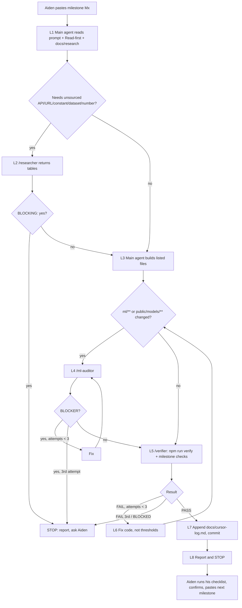

## 3. Subagent workflow (fixed; copied verbatim into `docs/research/workflow.md` in M0)

### 3.1 Roles

| Role | Trigger | Inputs | May touch | May NOT touch | Output (format → where) | What the main agent does with it |
|---|---|---|---|---|---|---|
| **Main agent** (Cursor Agent chat) | The milestone prompt you paste | the prompt, files under "Read first", `docs/research/*`, `.cursor/rules/*` | files listed under the milestone's "Files", plus tests and helpers inside the same directories (helpers are listed in the report). `docs/research/*` is written only with researcher output. `docs/cursor-log.md` is append-only. | other milestones' work, `docs/archive/**`, `ml/data/raw/**` in git, thresholds in a verify list, `git push` (unless you allow it in the paste message), `--final` test evaluation (except where the milestone says so) | code + the report (§3.4) → chat | n/a |
| **/researcher** (`readonly: true`) | Loop step L2. Required when the milestone needs an external API shape, URL, constant, dataset format, chip spec or published number that isn't already in `docs/research/` with status CONFIRMED or CORRECTED. | a numbered question list, each naming its target file `docs/research/<file>.md` | read the repo, search the web/docs | any file (readonly), any code | one table per target file: `TARGET: docs/research/<file>.md`, then a table with columns Item, Value, Unit, Source URL, Accessed, Status, Note. Status ∈ CONFIRMED, CORRECTED, UNVERIFIED. Ends with `BLOCKING: yes/no` → chat | Pastes the tables into the target files unchanged. `BLOCKING: no` → proceed, labeling UNVERIFIED values `UNVERIFIED` everywhere they're used. `BLOCKING: yes` → **stop and ask Aiden** (report status STOPPED). |
| **/verifier** (`readonly: false` so it can run terminal commands; told not to edit files) | Loop step L5 in every milestone, and after every fix (L6) | milestone id, attempt number, the milestone's "Agent verify" list | run commands. Build outputs those commands create (`.next/`, caches) are fine. | creating, editing or deleting tracked files; thresholds; tests; git commit/push; `--final` evaluation unless it's on the list | header line `VERIFY <Mx> attempt <n>: PASS/FAIL/BLOCKED`, a table with columns #, Check, Command, Expected, Actual, Result, then one likely-cause line per FAIL → chat | PASS → L7. FAIL → fix and re-run (L6). BLOCKED (missing key, network, input) → **stop and ask Aiden**. |
| **/ml-auditor** (`readonly: true`) | Loop step L4. Required when `git diff --name-only <milestone-start-sha>` includes `ml/**` or `public/models/**`. | milestone id, attempt number, the changed-file list | read the repo | any file (readonly), running training or `--final` | header line `AUDIT <Mx> attempt <n>: CLEAN/FINDINGS`, then a table with columns Rule (L1–L13 of `ml-rules.md`), File:line, Severity, Finding, Suggested fix. Severity is BLOCKER, SHOULD-FIX or OK. → chat | CLEAN → L5. BLOCKER → fix and re-audit (L6). SHOULD-FIX → fix, or record it in `docs/research/findings.md` with a reason, then L5. |

A BLOCKER is anything that could make a reported validation or test metric optimistic: leakage, test reuse, in-sample policy features, or features that aren't available live.

### 3.2 The per-milestone loop (L1–L8)
- **L1 Read.** Read the pasted prompt, every file under "Read first", and `docs/research/workflow.md`. Record the start commit: `git rev-parse HEAD`.
- **L2 Research gate (conditional).** If the milestone needs a fact that isn't sourced in `docs/research/`, call `/researcher` with the question list.
  - Paste its tables into the target files.
  - `BLOCKING: yes` → stop and ask Aiden.
- **L3 Build.** Do the numbered steps in order, touching only the listed files.
  - New numbers must come from `docs/research/` with a source, or be labeled `estimate` or `UNVERIFIED`.
- **L4 ML audit (conditional).** If `ml/**` or `public/models/**` changed, call `/ml-auditor`.
  - BLOCKER → fix, re-audit.
  - SHOULD-FIX → fix or log it in `findings.md`.
- **L5 Verify.** Call `/verifier` with the milestone's "Agent verify" list. It always runs `npm run verify` first.
- **L6 Fix loop.** On FAIL, the main agent fixes code (never the thresholds) and repeats L4 (if `ml/` changed again) and L5.
  - **Max 3 verifier attempts per milestone, and max 3 audit attempts.** The 3 is an `estimate` (a design choice).
  - After the 3rd FAIL or BLOCKER, **stop and report** with the failing rows.
  - BLOCKED → stop immediately and report what's needed.
- **L7 Log and commit.**
  - Append to `docs/cursor-log.md`: `| Mx | <date> | researcher: <n Qs / not used> | ml-auditor: <result / not used> | verifier: <PASS after n> | <short sha> |`
  - Then `git add -A && git commit -m "Mx: <goal>"`.
  - Don't push unless your paste message allows it.
  - Production deploys use `npx vercel deploy --prod` (linked in M0), so they don't depend on pushing.
- **L8 Report and STOP.** Post the report (§3.4). Don't start the next milestone.



### 3.3 Which steps apply
Each prompt has a line "Loop steps: …". L1, L3, L5, L6, L7 and L8 always apply. L2 and L4 apply only when the prompt marks them, or when their trigger fires anyway. A trigger always wins, so if a milestone unexpectedly touches `ml/`, L4 runs.

### 3.4 Report format (main agent, at L8)
```
## Mx report
Status: DONE | STOPPED at L<n> (<reason>)
Built: <files created/changed, helper files>
Subagents: researcher <n questions, BLOCKING?> | ml-auditor <CLEAN/FINDINGS, attempts> | verifier <PASS/FAIL/BLOCKED, attempts>
Verify table: <verifier's final table, verbatim>
New numbers introduced: | value | where used | label (source URL / estimate / UNVERIFIED) |
Findings / open issues: <bullets, also in docs/research/findings.md>
Needs from Aiden: <decisions or inputs, or "none">
```
